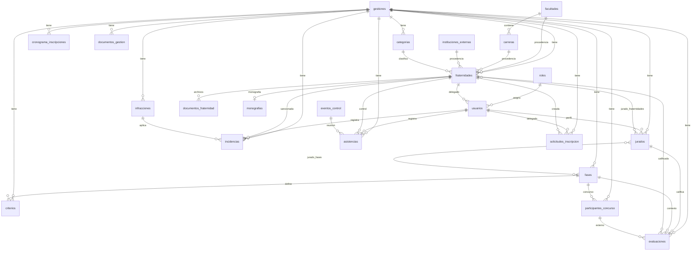

# Entrada Universitaria (EFU) — Diccionario y Esquema de Base de Datos

Documentación generada a partir de las **22 entidades TypeORM** en `backend/src/entities/`.

- **Motor:** PostgreSQL  
- **Base de datos:** `efu_db` (configurable vía `.env`)  
- **ORM:** TypeORM con `synchronize: true` (el esquema se alinea automáticamente al iniciar el backend)  
- **Última revisión:** junio 2026  

---

## Consideraciones generales

### Alcance por gestión vs. global

| Tipo | Tablas |
|------|--------|
| **Globales** (no dependen del año) | `roles`, `facultades`, `carreras`, `instituciones_externas`, `usuarios`, `eventos_control` |
| **Por gestión** (año del evento) | `gestiones`, `categorias`, `fraternidades`, `fases`, `criterios`, `jurados`, `evaluaciones`, `participantes_concurso`, `infracciones`, `incidencias`, `asistencias`, `solicitudes_inscripcion`, `cronograma_inscripciones`, `documentos_gestion` |
| **Por fraternidad** | `documentos_fraternidad`, `monografias` |

### Reglas de negocio relevantes (aplicación)

- Solo puede existir **un usuario con rol `delegado` por fraternidad** (validado en `UsuariosService`).
- Los textos de **solicitudes de inscripción** (nombres, fraternidad, directiva) se persisten en **MAYÚSCULAS**.
- Al **aprobar** una solicitud se crea o reutiliza la fraternidad oficial y se vincula al delegado.
- **Directorio de delegados:** solo delegado **titular** y **suplente** (datos en `solicitudes_inscripcion`).
- **Monografía:** cada fraternidad sube **un único PDF** vía su delegado; admin/jurado/superusuario lo consultan al calificar la fase Monografía.
- **Asistencia:** basta con que asista titular o suplente; si ninguno asiste → incidencia de −10 pts en disciplina.

### Diagrama de relaciones (resumen)



---

## 1. Módulo organizacional (global)

### `facultades`

Facultades de la UMSA.

| Columna | Tipo | Restricciones | Descripción |
|---------|------|---------------|-------------|
| `id_facultad` | SERIAL | PK | Identificador |
| `nombre` | VARCHAR(255) | NOT NULL, UNIQUE | Nombre completo |
| `sigla` | VARCHAR(20) | NULL | Sigla (ej. FCPN) |
| `created_at` | TIMESTAMP | NOT NULL | Creación |
| `updated_at` | TIMESTAMP | NOT NULL | Actualización |

### `carreras`

| Columna | Tipo | Restricciones | Descripción |
|---------|------|---------------|-------------|
| `id_carrera` | SERIAL | PK | Identificador |
| `id_facultad` | INTEGER | FK → `facultades`, ON DELETE CASCADE | Facultad padre |
| `nombre` | VARCHAR(255) | NOT NULL | Nombre de la carrera |
| `created_at` | TIMESTAMP | NOT NULL | Creación |
| `updated_at` | TIMESTAMP | NOT NULL | Actualización |

### `instituciones_externas`

| Columna | Tipo | Restricciones | Descripción |
|---------|------|---------------|-------------|
| `id_institucion` | SERIAL | PK | Identificador |
| `nombre` | VARCHAR(255) | NOT NULL, UNIQUE | Nombre |
| `sigla` | VARCHAR(20) | NULL | Sigla |
| `tipo_institucion` | VARCHAR(100) | NULL | Clasificación |
| `created_at` | TIMESTAMP | NOT NULL | Creación |
| `updated_at` | TIMESTAMP | NOT NULL | Actualización |

---

## 2. Módulo de gestión (año del evento)

### `gestiones`

Configuración central de cada año EFU.

| Columna | Tipo | Restricciones | Descripción |
|---------|------|---------------|-------------|
| `id_gestion` | SERIAL | PK | Identificador |
| `anio` | INTEGER | NOT NULL, UNIQUE | Año (ej. 2026) |
| `lema` | TEXT | NULL | Lema del evento |
| `activa` | BOOLEAN | DEFAULT false | Gestión en curso |
| `nombre_sitio` | VARCHAR(255) | NULL | Nombre público del sitio |
| `titulo_principal` | VARCHAR(255) | NULL | Título landing |
| `subtitulo_principal` | TEXT | NULL | Subtítulo landing |
| `url_banner` | VARCHAR(500) | NULL | Banner |
| `url_logo` | VARCHAR(500) | NULL | Logo |
| `url_imagen_login` | VARCHAR(500) | NULL | Imagen login |
| `url_mapa_ubicacion` | VARCHAR(500) | NULL | Mapa |
| `modo_mantenimiento` | BOOLEAN | DEFAULT false | Sitio en mantenimiento |
| `mostrar_ranking` | BOOLEAN | DEFAULT true | Mostrar ranking público |
| `permite_inscripcion_publica` | BOOLEAN | DEFAULT false | Registro público delegados |
| `created_at` | TIMESTAMP | NOT NULL | Creación |
| `updated_at` | TIMESTAMP | NOT NULL | Actualización |

### `categorias`

Categorías de danza por gestión (A, B, C, etc.).

| Columna | Tipo | Restricciones | Descripción |
|---------|------|---------------|-------------|
| `id_categoria` | SERIAL | PK | Identificador |
| `id_gestion` | INTEGER | FK → `gestiones`, ON DELETE CASCADE | Gestión |
| `nombre` | VARCHAR(50) | NOT NULL | Nombre categoría |
| `descripcion` | TEXT | NULL | Definición reglamentaria |
| `created_at` | TIMESTAMP | NOT NULL | Creación |
| `updated_at` | TIMESTAMP | NOT NULL | Actualización |

### `cronograma_inscripciones`

Ventanas de inscripción por categoría.

| Columna | Tipo | Restricciones | Descripción |
|---------|------|---------------|-------------|
| `id_cronograma` | SERIAL | PK | Identificador |
| `id_gestion` | INTEGER | FK → `gestiones` | Gestión |
| `id_categoria` | INTEGER | FK → `categorias` | Categoría |
| `fecha_inicio` | TIMESTAMP | NOT NULL | Inicio inscripción |
| `fecha_fin` | TIMESTAMP | NOT NULL | Fin inscripción |
| `created_at` | TIMESTAMP | NOT NULL | Creación |
| `updated_at` | TIMESTAMP | NOT NULL | Actualización |

### `documentos_gestion`

Reglamentos y PDFs institucionales por gestión.

| Columna | Tipo | Restricciones | Descripción |
|---------|------|---------------|-------------|
| `id_documento` | SERIAL | PK | Identificador |
| `titulo` | VARCHAR(255) | NOT NULL | Título |
| `descripcion` | TEXT | NULL | Descripción |
| `tipo` | VARCHAR(100) | DEFAULT 'otro' | Tipo (reglamento_efu, etc.) |
| `url_pdf` | VARCHAR(500) | NOT NULL | Ruta del PDF |
| `orden` | INTEGER | DEFAULT 0 | Orden de visualización |
| `id_gestion` | INTEGER | FK → `gestiones`, ON DELETE CASCADE | Gestión |
| `created_at` | TIMESTAMP | NOT NULL | Creación |

---

## 3. Módulo fraternidades

### `fraternidades`

Participación oficial de un grupo folclórico en una gestión.

| Columna | Tipo | Restricciones | Descripción |
|---------|------|---------------|-------------|
| `id_fraternidad` | SERIAL | PK | Identificador |
| `nombre` | VARCHAR(255) | NOT NULL, **UNIQUE** | Nombre (único global) |
| `origen_fraternidad` | VARCHAR(50) | NOT NULL | Tipo de danza / origen |
| `nivel_representacion` | VARCHAR(100) | NULL | Facultad, Carrera, UMSA, etc. |
| `id_gestion` | INTEGER | FK → `gestiones`, ON DELETE CASCADE | Gestión |
| `id_facultad` | INTEGER | FK → `facultades`, ON DELETE SET NULL | Facultad |
| `id_carrera` | INTEGER | FK → `carreras`, ON DELETE SET NULL | Carrera |
| `id_institucion_externa` | INTEGER | FK → `instituciones_externas`, ON DELETE SET NULL | Institución externa |
| `id_categoria` | INTEGER | FK → `categorias` | Categoría de concurso |
| `tipo_organizacion` | VARCHAR(100) | NULL | Tipo organizacional |
| `fecha_fundacion` | DATE | NULL | Fecha fundación |
| `habilitado_efu` | BOOLEAN | DEFAULT true | Habilitada para EFU |
| `logo_url` | TEXT | NULL | URL del logo |
| `promedio_base` | NUMERIC(5,2) | DEFAULT 0 | Promedio base |
| `created_at` | TIMESTAMP | NOT NULL | Creación |
| `updated_at` | TIMESTAMP | NOT NULL | Actualización |

### `documentos_fraternidad`

| Columna | Tipo | Restricciones | Descripción |
|---------|------|---------------|-------------|
| `id_documento` | SERIAL | PK | Identificador |
| `id_fraternidad` | INTEGER | FK → `fraternidades` | Fraternidad |
| `tipo_documento` | VARCHAR(50) | NOT NULL | Tipo de documento |
| `url_archivo` | VARCHAR(500) | NOT NULL | Ruta del archivo |
| `fecha_subida` | TIMESTAMP | NOT NULL | Fecha de subida |

### `monografias`

Monografía única por fraternidad, subida por el delegado. Archivo en `uploads/Doc_Monografia/`.

| Columna | Tipo | Restricciones | Descripción |
|---------|------|---------------|-------------|
| `id_monografia` | SERIAL | PK | Identificador |
| `id_fraternidad` | INTEGER | FK → `fraternidades`, **UNIQUE** | Fraternidad (1:1) |
| `url_archivo` | VARCHAR(500) | NOT NULL | Ruta del PDF |
| `nombre_archivo` | VARCHAR(255) | NULL | Nombre original del archivo |
| `id_usuario_subio` | INTEGER | FK → `usuarios`, NULL | Delegado que subió |
| `fecha_subida` | TIMESTAMP | NOT NULL | Primera subida |
| `updated_at` | TIMESTAMP | NOT NULL | Última actualización |

**Reglas:** una fraternidad solo puede tener una monografía; solo el delegado asignado puede subirla o reemplazarla; admin, jurado y superusuario pueden consultarla al calificar.

---

## 4. Módulo inscripción / preinscripción

### `solicitudes_inscripcion`

Formulario de 33 puntos enviado por el delegado antes de la inscripción oficial.

**Enums:**

- `estado`: `PENDIENTE` | `OBSERVADO` | `APROBADO` | `RECHAZADO`
- `instancia_representacion`: `Facultad` | `Carrera` | `UMSA` | `FEDSIDUMSA` | `STUMSA` | `Externo`

| Columna | Tipo | Descripción |
|---------|------|-------------|
| `id_solicitud` | SERIAL PK | Identificador |
| `id_gestion` | FK → `gestiones` | Gestión |
| `id_usuario_delegado` | FK → `usuarios` | Usuario delegado |
| `nombre_fraternidad` | VARCHAR(255) | Nombre solicitado (MAYÚSCULAS) |
| `origen_fraternidad` | VARCHAR(50) | Origen / tipo danza |
| `instancia_representacion` | ENUM | Nivel de representación |
| `id_facultad` | FK nullable | Facultad |
| `id_carrera` | FK nullable | Carrera |
| `id_institucion_externa` | FK nullable | Institución externa catálogo |
| `nombre_institucion_externa` | VARCHAR(255) | Nombre libre si es externo |
| `id_categoria` | FK → `categorias` | Categoría |
| `presi_nombre`, `presi_ci`, `presi_celular` | VARCHAR | Presidente |
| `vice_nombre`, `vice_ci`, `vice_celular` | VARCHAR | Vicepresidente |
| `sec_gen_nombre`, `sec_gen_ci` | VARCHAR | Secretario general |
| `sec_haci_nombre`, `sec_haci_ci` | VARCHAR | Secretario hacienda |
| `sec_actas_nombre`, `sec_actas_ci` | VARCHAR | Secretario actas |
| `sec_prensa_nombre`, `sec_prensa_ci` | VARCHAR | Secretario prensa |
| `vocal_nombre`, `vocal_ci` | VARCHAR | Vocal |
| `del_cogob_nombre`, `del_cogob_ci`, `del_cogob_celular` | VARCHAR | Delegado co-gobierno |
| `del_titular_nombre`, `del_titular_ci`, `del_titular_celular` | VARCHAR | **Delegado titular** |
| `del_suplente_nombre`, `del_suplente_ci`, `del_suplente_celular` | VARCHAR | **Delegado suplente** |
| `url_ci_matricula_pre_vice_del` | VARCHAR(500) | Doc. punto 29 |
| `url_ci_matricula_sec_voc_del` | VARCHAR(500) | Doc. punto 30 |
| `url_carta_compromiso` | VARCHAR(500) | Doc. punto 31 |
| `url_resolucion` | VARCHAR(500) | Doc. punto 32 |
| `url_acta_directiva` | VARCHAR(500) | Doc. punto 33 |
| `estado` | ENUM | Estado administrativo |
| `observaciones` | TEXT | Observaciones del admin |
| `revision_checklist` | JSONB | Checklist de revisión por campo `{ estado: PENDIENTE\|OK\|X, comentario? }` |
| `id_fraternidad_creada` | FK nullable → `fraternidades` | Fraternidad oficial al aprobar |
| `created_at`, `updated_at` | TIMESTAMP | Auditoría |

---

## 5. Módulo usuarios y roles

### `roles`

| Columna | Tipo | Restricciones | Descripción |
|---------|------|---------------|-------------|
| `id_rol` | SERIAL | PK | Identificador |
| `nombre` | VARCHAR(100) | NOT NULL, UNIQUE | `superusuario`, `admin`, `controladorhcu`, `delegado`, `jurado` |
| `descripcion` | TEXT | NULL | Descripción del rol |
| `created_at`, `updated_at` | TIMESTAMP | NOT NULL | Auditoría |

### `usuarios`

| Columna | Tipo | Restricciones | Descripción |
|---------|------|---------------|-------------|
| `id_usuario` | SERIAL | PK | Identificador |
| `id_rol` | INTEGER | FK → `roles` | Rol del usuario |
| `ci` | VARCHAR(20) | NOT NULL, UNIQUE | Carnet de identidad (login) |
| `nombres` | VARCHAR(150) | NOT NULL | Nombres |
| `primer_apellido` | VARCHAR(100) | NOT NULL | Primer apellido |
| `segundo_apellido` | VARCHAR(100) | NULL | Segundo apellido |
| `correo` | VARCHAR(255) | UNIQUE, NULL | Correo electrónico (obligatorio en usuarios nuevos; legacy puede ser NULL) |
| `password` | VARCHAR(255) | NOT NULL | Hash bcrypt |
| `id_fraternidad` | INTEGER | FK nullable → `fraternidades` | Fraternidad del delegado |
| `primer_login` | BOOLEAN | DEFAULT true | Forzar cambio de contraseña |
| `created_at`, `updated_at` | TIMESTAMP | NOT NULL | Auditoría |

### `password_reset_tokens`

Tokens OTP para recuperación de contraseña.

| Columna | Tipo | Restricciones | Descripción |
|---------|------|---------------|-------------|
| `id_token` | SERIAL | PK | Identificador |
| `id_usuario` | INTEGER | FK → `usuarios`, ON DELETE CASCADE | Usuario |
| `code_hash` | VARCHAR(255) | NOT NULL | Hash bcrypt del código OTP de 6 dígitos |
| `expires_at` | TIMESTAMP | NOT NULL | Expiración (15 minutos) |
| `attempts` | INTEGER | DEFAULT 0 | Intentos fallidos de verificación (máx. 5) |
| `used_at` | TIMESTAMP | NULL | Fecha de consumo del token |
| `reset_session_id` | VARCHAR(64) | NULL | Sesión de un solo uso para JWT de reset |
| `created_at` | TIMESTAMP | NOT NULL | Auditoría / rate limit (3 solicitudes/hora) |

---

## 6. Módulo evaluaciones

### `fases`

| Columna | Tipo | Descripción |
|---------|------|-------------|
| `id_fase` | SERIAL PK | Identificador |
| `id_gestion` | FK → `gestiones` | Gestión |
| `nombre` | VARCHAR(255) | Nombre (Monografía, Entrada, etc.) |
| `peso_porcentaje` | NUMERIC(5,2) | Peso en nota final EFU |
| `tipo_concurso` | VARCHAR(50) | `EFU` o `EXTERNO` |
| `categoria_efu` | VARCHAR(50) | Subcategoría EFU (MONOGRAFIA, DANZA, etc.) |
| `es_precalificacion` | BOOLEAN | Es fase de precalificación |
| `fecha_inicio`, `fecha_fin` | TIMESTAMP | Ventana de evaluación |
| `esta_activa` | BOOLEAN | Fase habilitada |
| `url_imagen` | VARCHAR(500) | Imagen de la fase |
| `created_at`, `updated_at` | TIMESTAMP | Auditoría |

### `criterios`

| Columna | Tipo | Descripción |
|---------|------|-------------|
| `id_criterio` | SERIAL PK | Identificador |
| `id_gestion` | FK, ON DELETE CASCADE | Gestión |
| `id_fase` | FK → `fases` | Fase |
| `nombre` | VARCHAR(255) | Nombre del criterio |
| `puntaje_maximo` | NUMERIC(5,2) | Puntaje máximo |
| `url_imagen` | VARCHAR(500) | Imagen ilustrativa |
| `created_at`, `updated_at` | TIMESTAMP | Auditoría |

### `jurados`

Perfil de calificador vinculado a un usuario.

| Columna | Tipo | Descripción |
|---------|------|-------------|
| `id_jurado` | SERIAL PK | Identificador |
| `id_usuario` | FK → `usuarios` | Usuario |
| `id_gestion` | FK → `gestiones` | Gestión |
| `tipo_origen` | VARCHAR(100) | Origen del perfil |
| `tipo_jurado` | VARCHAR(20) | `EFU`, `EXTERNO`, `AMBOS` |
| `id_carrera` | FK nullable | Carrera (si aplica) |
| `institucion_externa` | VARCHAR(255) | Texto libre |
| `created_at`, `updated_at` | TIMESTAMP | Auditoría |

### `jurado_fases` (tabla intermedia M:N)

| Columna | Tipo | Descripción |
|---------|------|-------------|
| `id_jurado` | FK → `jurados` | Jurado |
| `id_fase` | FK → `fases` | Fase habilitada |

### `jurado_fraternidades` (tabla intermedia M:N)

| Columna | Tipo | Descripción |
|---------|------|-------------|
| `id_jurado` | FK → `jurados` | Jurado |
| `id_fraternidad` | FK → `fraternidades` | Fraternidad restringida (vacío = todas) |

### `evaluaciones`

| Columna | Tipo | Descripción |
|---------|------|-------------|
| `id_evaluacion` | SERIAL PK | Identificador |
| `id_gestion` | FK → `gestiones` | Gestión |
| `id_jurado` | FK → `jurados` | Jurado calificador |
| `id_fraternidad` | FK nullable | Fraternidad (EFU) |
| `id_fase` | FK → `fases` | Fase |
| `id_participante` | FK nullable → `participantes_concurso` | Participante (EXTERNO) |
| `estado` | ENUM | `PENDIENTE`, `EN_PROGRESO`, `COMPLETADO` |
| `criterios_evaluados` | JSONB | Detalle por criterio |
| `puntaje_total` | NUMERIC(5,2) | Puntaje total |
| `fecha_apertura`, `fecha_cierre` | TIMESTAMP | Ventana de calificación |
| `created_at`, `updated_at` | TIMESTAMP | Auditoría |

---

## 7. Módulo participantes (concursos externos)

### `participantes_concurso`

| Columna | Tipo | Descripción |
|---------|------|-------------|
| `id_participante` | SERIAL PK | Identificador |
| `id_gestion` | FK, ON DELETE CASCADE | Gestión |
| `nombre` | VARCHAR(255) | Nombre completo |
| `tipo` | VARCHAR(100) | Chacha, Warmi, Fotógrafo, etc. |
| `es_umsa` | BOOLEAN | Procede de UMSA |
| `id_facultad`, `id_carrera` | FK nullable | Procedencia UMSA |
| `institucion_externa` | VARCHAR(255) | Procedencia externa |
| `pertenece_fraternidad` | BOOLEAN | Vinculado a fraternidad |
| `id_fraternidad` | FK nullable | Fraternidad |
| `id_fase` | FK → `fases`, ON DELETE CASCADE | Concurso externo |
| `created_at`, `updated_at` | TIMESTAMP | Auditoría |

---

## 8. Módulo disciplina e incidencias

### `infracciones`

Catálogo de sanciones por gestión.

| Columna | Tipo | Descripción |
|---------|------|-------------|
| `id_infraccion` | SERIAL PK | Identificador |
| `id_gestion` | FK → `gestiones` | Gestión |
| `nombre` | VARCHAR(255) | Nombre (ej. INASISTENCIA DE DELEGADO) |
| `tipo_impacto` | VARCHAR(100) | Ej. DESCUENTO_DISCIPLINA, RESTA_PUNTOS |
| `valor_impacto` | NUMERIC(5,2) | Valor (negativo = descuento) |
| `created_at`, `updated_at` | TIMESTAMP | Auditoría |

### `incidencias`

Registro de sanciones aplicadas a una fraternidad.

| Columna | Tipo | Descripción |
|---------|------|-------------|
| `id_incidencia` | SERIAL PK | Identificador |
| `id_gestion` | FK → `gestiones` | Gestión |
| `id_fraternidad` | FK → `fraternidades` | Fraternidad sancionada |
| `id_usuario` | FK → `usuarios` | Usuario que registra |
| `id_infraccion` | FK → `infracciones` | Tipo de infracción |
| `fecha_hora` | TIMESTAMP | Fecha del hecho |
| `observacion` | TEXT | Detalle |
| `created_at`, `updated_at` | TIMESTAMP | Auditoría |

---

## 9. Módulo asistencia de delegados

### `eventos_control`

Reuniones / eventos de control (global, no por gestión en entidad actual).

| Columna | Tipo | Descripción |
|---------|------|-------------|
| `id_evento` | SERIAL PK | Identificador |
| `nombre` | VARCHAR(255) | Nombre del evento |
| `fecha_hora` | TIMESTAMP | Fecha y hora |
| `puntos_penalizacion` | NUMERIC(5,2) | Penalización por defecto |
| `created_at`, `updated_at` | TIMESTAMP | Auditoría |

### `asistencias`

Registro de asistencia por fraternidad y evento.

| Columna | Tipo | Descripción |
|---------|------|-------------|
| `id_asistencia` | SERIAL PK | Identificador |
| `id_gestion` | FK → `gestiones` | Gestión |
| `id_fraternidad` | FK → `fraternidades` | Fraternidad |
| `id_usuario` | FK → `usuarios` | Controlador que registra |
| `id_evento` | FK → `eventos_control` | Evento |
| `asistio` | BOOLEAN | Presente (titular o suplente) |
| `observaciones` | TEXT | Detalle titular/suplente |
| `created_at`, `updated_at` | TIMESTAMP | Auditoría |

---

## 10. Esquema SQL completo (PostgreSQL)

Script de referencia equivalente al modelo TypeORM actual.  
**Nota:** con `synchronize: true` TypeORM crea/altera estas estructuras automáticamente; use este SQL para documentación, migraciones manuales o entornos nuevos.

```sql
-- ============================================================
-- EFU — Esquema PostgreSQL
-- Base de datos: efu_db
-- ============================================================

-- Extensiones (opcional)
-- CREATE EXTENSION IF NOT EXISTS "uuid-ossp";

-- ------------------------------------------------------------
-- Tipos enumerados
-- ------------------------------------------------------------
DO $$ BEGIN
    CREATE TYPE estado_solicitud AS ENUM ('PENDIENTE', 'OBSERVADO', 'APROBADO', 'RECHAZADO');
EXCEPTION WHEN duplicate_object THEN NULL; END $$;

DO $$ BEGIN
    CREATE TYPE instancia_representacion AS ENUM ('Facultad', 'Carrera', 'UMSA', 'FEDSIDUMSA', 'STUMSA', 'Externo');
EXCEPTION WHEN duplicate_object THEN NULL; END $$;

DO $$ BEGIN
    CREATE TYPE estado_evaluacion AS ENUM ('PENDIENTE', 'EN_PROGRESO', 'COMPLETADO');
EXCEPTION WHEN duplicate_object THEN NULL; END $$;

-- ------------------------------------------------------------
-- 1. Organización (global)
-- ------------------------------------------------------------
CREATE TABLE IF NOT EXISTS facultades (
    id_facultad     SERIAL PRIMARY KEY,
    nombre          VARCHAR(255) NOT NULL UNIQUE,
    sigla           VARCHAR(20),
    created_at      TIMESTAMP NOT NULL DEFAULT NOW(),
    updated_at      TIMESTAMP NOT NULL DEFAULT NOW()
);

CREATE TABLE IF NOT EXISTS carreras (
    id_carrera      SERIAL PRIMARY KEY,
    id_facultad     INTEGER NOT NULL REFERENCES facultades(id_facultad) ON DELETE CASCADE,
    nombre          VARCHAR(255) NOT NULL,
    created_at      TIMESTAMP NOT NULL DEFAULT NOW(),
    updated_at      TIMESTAMP NOT NULL DEFAULT NOW()
);

CREATE TABLE IF NOT EXISTS instituciones_externas (
    id_institucion      SERIAL PRIMARY KEY,
    nombre              VARCHAR(255) NOT NULL UNIQUE,
    sigla               VARCHAR(20),
    tipo_institucion    VARCHAR(100),
    created_at          TIMESTAMP NOT NULL DEFAULT NOW(),
    updated_at          TIMESTAMP NOT NULL DEFAULT NOW()
);

-- ------------------------------------------------------------
-- 2. Gestión
-- ------------------------------------------------------------
CREATE TABLE IF NOT EXISTS gestiones (
    id_gestion                  SERIAL PRIMARY KEY,
    anio                        INTEGER NOT NULL UNIQUE,
    lema                        TEXT,
    activa                      BOOLEAN NOT NULL DEFAULT FALSE,
    nombre_sitio                VARCHAR(255),
    titulo_principal            VARCHAR(255),
    subtitulo_principal         TEXT,
    url_banner                  VARCHAR(500),
    url_logo                    VARCHAR(500),
    url_imagen_login            VARCHAR(500),
    url_mapa_ubicacion          VARCHAR(500),
    modo_mantenimiento          BOOLEAN NOT NULL DEFAULT FALSE,
    mostrar_ranking             BOOLEAN NOT NULL DEFAULT TRUE,
    permite_inscripcion_publica BOOLEAN NOT NULL DEFAULT FALSE,
    created_at                  TIMESTAMP NOT NULL DEFAULT NOW(),
    updated_at                  TIMESTAMP NOT NULL DEFAULT NOW()
);

CREATE TABLE IF NOT EXISTS categorias (
    id_categoria    SERIAL PRIMARY KEY,
    id_gestion      INTEGER NOT NULL REFERENCES gestiones(id_gestion) ON DELETE CASCADE,
    nombre          VARCHAR(50) NOT NULL,
    descripcion     TEXT,
    created_at      TIMESTAMP NOT NULL DEFAULT NOW(),
    updated_at      TIMESTAMP NOT NULL DEFAULT NOW()
);

CREATE TABLE IF NOT EXISTS cronograma_inscripciones (
    id_cronograma   SERIAL PRIMARY KEY,
    id_gestion      INTEGER NOT NULL REFERENCES gestiones(id_gestion),
    id_categoria    INTEGER NOT NULL REFERENCES categorias(id_categoria),
    fecha_inicio    TIMESTAMP NOT NULL,
    fecha_fin       TIMESTAMP NOT NULL,
    created_at      TIMESTAMP NOT NULL DEFAULT NOW(),
    updated_at      TIMESTAMP NOT NULL DEFAULT NOW()
);

CREATE TABLE IF NOT EXISTS documentos_gestion (
    id_documento    SERIAL PRIMARY KEY,
    titulo          VARCHAR(255) NOT NULL,
    descripcion     TEXT,
    tipo            VARCHAR(100) NOT NULL DEFAULT 'otro',
    url_pdf         VARCHAR(500) NOT NULL,
    orden           INTEGER NOT NULL DEFAULT 0,
    id_gestion      INTEGER NOT NULL REFERENCES gestiones(id_gestion) ON DELETE CASCADE,
    created_at      TIMESTAMP NOT NULL DEFAULT NOW()
);

-- ------------------------------------------------------------
-- 3. Fraternidades
-- ------------------------------------------------------------
CREATE TABLE IF NOT EXISTS fraternidades (
    id_fraternidad          SERIAL PRIMARY KEY,
    nombre                  VARCHAR(255) NOT NULL UNIQUE,
    origen_fraternidad      VARCHAR(50) NOT NULL,
    nivel_representacion    VARCHAR(100),
    id_gestion              INTEGER REFERENCES gestiones(id_gestion) ON DELETE CASCADE,
    id_facultad             INTEGER REFERENCES facultades(id_facultad) ON DELETE SET NULL,
    id_carrera              INTEGER REFERENCES carreras(id_carrera) ON DELETE SET NULL,
    id_institucion_externa  INTEGER REFERENCES instituciones_externas(id_institucion) ON DELETE SET NULL,
    id_categoria            INTEGER REFERENCES categorias(id_categoria),
    tipo_organizacion       VARCHAR(100),
    fecha_fundacion         DATE,
    habilitado_efu          BOOLEAN NOT NULL DEFAULT TRUE,
    logo_url                TEXT,
    promedio_base           NUMERIC(5,2) NOT NULL DEFAULT 0,
    created_at              TIMESTAMP NOT NULL DEFAULT NOW(),
    updated_at              TIMESTAMP NOT NULL DEFAULT NOW()
);

CREATE TABLE IF NOT EXISTS documentos_fraternidad (
    id_documento        SERIAL PRIMARY KEY,
    id_fraternidad      INTEGER NOT NULL REFERENCES fraternidades(id_fraternidad),
    tipo_documento      VARCHAR(50) NOT NULL,
    url_archivo         VARCHAR(500) NOT NULL,
    fecha_subida        TIMESTAMP NOT NULL DEFAULT NOW()
);

-- ------------------------------------------------------------
-- 4. Roles y usuarios
-- ------------------------------------------------------------
CREATE TABLE IF NOT EXISTS roles (
    id_rol          SERIAL PRIMARY KEY,
    nombre          VARCHAR(100) NOT NULL UNIQUE,
    descripcion     TEXT,
    created_at      TIMESTAMP NOT NULL DEFAULT NOW(),
    updated_at      TIMESTAMP NOT NULL DEFAULT NOW()
);

CREATE TABLE IF NOT EXISTS usuarios (
    id_usuario          SERIAL PRIMARY KEY,
    id_rol              INTEGER NOT NULL REFERENCES roles(id_rol),
    ci                  VARCHAR(20) NOT NULL UNIQUE,
    nombres             VARCHAR(150) NOT NULL,
    primer_apellido     VARCHAR(100) NOT NULL,
    segundo_apellido    VARCHAR(100),
    correo              VARCHAR(255) UNIQUE,
    password            VARCHAR(255) NOT NULL,
    id_fraternidad      INTEGER REFERENCES fraternidades(id_fraternidad) ON DELETE SET NULL,
    primer_login        BOOLEAN NOT NULL DEFAULT TRUE,
    created_at          TIMESTAMP NOT NULL DEFAULT NOW(),
    updated_at          TIMESTAMP NOT NULL DEFAULT NOW()
);

CREATE TABLE IF NOT EXISTS monografias (
    id_monografia       SERIAL PRIMARY KEY,
    id_fraternidad      INTEGER NOT NULL UNIQUE REFERENCES fraternidades(id_fraternidad) ON DELETE CASCADE,
    url_archivo         VARCHAR(500) NOT NULL,
    nombre_archivo      VARCHAR(255),
    id_usuario_subio    INTEGER REFERENCES usuarios(id_usuario) ON DELETE SET NULL,
    fecha_subida        TIMESTAMP NOT NULL DEFAULT NOW(),
    updated_at          TIMESTAMP NOT NULL DEFAULT NOW()
);

CREATE TABLE IF NOT EXISTS password_reset_tokens (
    id_token            SERIAL PRIMARY KEY,
    id_usuario          INTEGER NOT NULL REFERENCES usuarios(id_usuario) ON DELETE CASCADE,
    code_hash           VARCHAR(255) NOT NULL,
    expires_at          TIMESTAMP NOT NULL,
    attempts            INTEGER NOT NULL DEFAULT 0,
    used_at             TIMESTAMP,
    reset_session_id    VARCHAR(64),
    created_at          TIMESTAMP NOT NULL DEFAULT NOW()
);

-- ------------------------------------------------------------
-- 5. Solicitudes de inscripción
-- ------------------------------------------------------------
CREATE TABLE IF NOT EXISTS solicitudes_inscripcion (
    id_solicitud                    SERIAL PRIMARY KEY,
    id_gestion                      INTEGER NOT NULL REFERENCES gestiones(id_gestion),
    id_usuario_delegado             INTEGER NOT NULL REFERENCES usuarios(id_usuario),
    nombre_fraternidad              VARCHAR(255) NOT NULL,
    origen_fraternidad              VARCHAR(50) NOT NULL DEFAULT 'General',
    instancia_representacion        instancia_representacion NOT NULL,
    id_facultad                     INTEGER REFERENCES facultades(id_facultad),
    id_carrera                      INTEGER REFERENCES carreras(id_carrera),
    id_institucion_externa          INTEGER REFERENCES instituciones_externas(id_institucion),
    nombre_institucion_externa      VARCHAR(255),
    id_categoria                    INTEGER NOT NULL REFERENCES categorias(id_categoria),
    presi_nombre                    VARCHAR(255),
    presi_ci                        VARCHAR(50),
    presi_celular                   VARCHAR(50),
    vice_nombre                     VARCHAR(255),
    vice_ci                         VARCHAR(50),
    vice_celular                    VARCHAR(50),
    sec_gen_nombre                  VARCHAR(255),
    sec_gen_ci                      VARCHAR(50),
    sec_haci_nombre                 VARCHAR(255),
    sec_haci_ci                     VARCHAR(50),
    sec_actas_nombre                VARCHAR(255),
    sec_actas_ci                    VARCHAR(50),
    sec_prensa_nombre               VARCHAR(255),
    sec_prensa_ci                   VARCHAR(50),
    vocal_nombre                    VARCHAR(255),
    vocal_ci                        VARCHAR(50),
    del_cogob_nombre                VARCHAR(255),
    del_cogob_ci                    VARCHAR(50),
    del_cogob_celular               VARCHAR(50),
    del_titular_nombre              VARCHAR(255),
    del_titular_ci                  VARCHAR(50),
    del_titular_celular             VARCHAR(50),
    del_suplente_nombre             VARCHAR(255),
    del_suplente_ci                 VARCHAR(50),
    del_suplente_celular            VARCHAR(50),
    url_ci_matricula_pre_vice_del   VARCHAR(500),
    url_ci_matricula_sec_voc_del    VARCHAR(500),
    url_carta_compromiso            VARCHAR(500),
    url_resolucion                  VARCHAR(500),
    url_acta_directiva              VARCHAR(500),
    estado                          estado_solicitud NOT NULL DEFAULT 'PENDIENTE',
    observaciones                   TEXT,
    revision_checklist              JSONB DEFAULT '{}'::jsonb,
    id_fraternidad_creada           INTEGER REFERENCES fraternidades(id_fraternidad) ON DELETE SET NULL,
    created_at                      TIMESTAMP NOT NULL DEFAULT NOW(),
    updated_at                      TIMESTAMP NOT NULL DEFAULT NOW()
);

-- ------------------------------------------------------------
-- 6. Fases, criterios y evaluaciones
-- ------------------------------------------------------------
CREATE TABLE IF NOT EXISTS fases (
    id_fase             SERIAL PRIMARY KEY,
    id_gestion          INTEGER NOT NULL REFERENCES gestiones(id_gestion),
    nombre              VARCHAR(255) NOT NULL,
    peso_porcentaje     NUMERIC(5,2) NOT NULL,
    tipo_concurso       VARCHAR(50) NOT NULL DEFAULT 'EFU',
    categoria_efu       VARCHAR(50),
    es_precalificacion  BOOLEAN NOT NULL DEFAULT FALSE,
    fecha_inicio        TIMESTAMP,
    fecha_fin           TIMESTAMP,
    esta_activa         BOOLEAN NOT NULL DEFAULT FALSE,
    url_imagen          VARCHAR(500),
    created_at          TIMESTAMP NOT NULL DEFAULT NOW(),
    updated_at          TIMESTAMP NOT NULL DEFAULT NOW()
);

CREATE TABLE IF NOT EXISTS criterios (
    id_criterio     SERIAL PRIMARY KEY,
    id_gestion      INTEGER NOT NULL REFERENCES gestiones(id_gestion) ON DELETE CASCADE,
    id_fase         INTEGER NOT NULL REFERENCES fases(id_fase),
    nombre          VARCHAR(255) NOT NULL,
    puntaje_maximo  NUMERIC(5,2) NOT NULL,
    url_imagen      VARCHAR(500),
    created_at      TIMESTAMP NOT NULL DEFAULT NOW(),
    updated_at      TIMESTAMP NOT NULL DEFAULT NOW()
);

CREATE TABLE IF NOT EXISTS jurados (
    id_jurado           SERIAL PRIMARY KEY,
    id_usuario          INTEGER NOT NULL REFERENCES usuarios(id_usuario),
    id_gestion          INTEGER NOT NULL REFERENCES gestiones(id_gestion),
    tipo_origen         VARCHAR(100),
    tipo_jurado         VARCHAR(20) NOT NULL DEFAULT 'EFU',
    id_carrera          INTEGER REFERENCES carreras(id_carrera) ON DELETE SET NULL,
    institucion_externa VARCHAR(255),
    created_at          TIMESTAMP NOT NULL DEFAULT NOW(),
    updated_at          TIMESTAMP NOT NULL DEFAULT NOW()
);

CREATE TABLE IF NOT EXISTS jurado_fases (
    id_jurado   INTEGER NOT NULL REFERENCES jurados(id_jurado) ON DELETE CASCADE,
    id_fase     INTEGER NOT NULL REFERENCES fases(id_fase) ON DELETE CASCADE,
    PRIMARY KEY (id_jurado, id_fase)
);

CREATE TABLE IF NOT EXISTS jurado_fraternidades (
    id_jurado       INTEGER NOT NULL REFERENCES jurados(id_jurado) ON DELETE CASCADE,
    id_fraternidad  INTEGER NOT NULL REFERENCES fraternidades(id_fraternidad) ON DELETE CASCADE,
    PRIMARY KEY (id_jurado, id_fraternidad)
);

CREATE TABLE IF NOT EXISTS evaluaciones (
    id_evaluacion       SERIAL PRIMARY KEY,
    id_gestion          INTEGER NOT NULL REFERENCES gestiones(id_gestion),
    id_jurado           INTEGER NOT NULL REFERENCES jurados(id_jurado),
    id_fraternidad      INTEGER REFERENCES fraternidades(id_fraternidad),
    id_fase             INTEGER NOT NULL REFERENCES fases(id_fase),
    id_participante     INTEGER,
    estado              estado_evaluacion NOT NULL DEFAULT 'PENDIENTE',
    criterios_evaluados JSONB,
    puntaje_total       NUMERIC(5,2) NOT NULL DEFAULT 0,
    fecha_apertura      TIMESTAMP,
    fecha_cierre        TIMESTAMP,
    created_at          TIMESTAMP NOT NULL DEFAULT NOW(),
    updated_at          TIMESTAMP NOT NULL DEFAULT NOW()
);

-- FK participante (tabla creada después)
-- ALTER TABLE evaluaciones ADD CONSTRAINT fk_eval_participante
--   FOREIGN KEY (id_participante) REFERENCES participantes_concurso(id_participante) ON DELETE SET NULL;

-- ------------------------------------------------------------
-- 7. Participantes concurso externo
-- ------------------------------------------------------------
CREATE TABLE IF NOT EXISTS participantes_concurso (
    id_participante         SERIAL PRIMARY KEY,
    id_gestion              INTEGER NOT NULL REFERENCES gestiones(id_gestion) ON DELETE CASCADE,
    nombre                  VARCHAR(255) NOT NULL,
    tipo                    VARCHAR(100),
    es_umsa                 BOOLEAN NOT NULL DEFAULT FALSE,
    id_facultad             INTEGER REFERENCES facultades(id_facultad) ON DELETE SET NULL,
    id_carrera              INTEGER REFERENCES carreras(id_carrera) ON DELETE SET NULL,
    institucion_externa     VARCHAR(255),
    pertenece_fraternidad   BOOLEAN NOT NULL DEFAULT FALSE,
    id_fraternidad          INTEGER REFERENCES fraternidades(id_fraternidad) ON DELETE SET NULL,
    id_fase                 INTEGER NOT NULL REFERENCES fases(id_fase) ON DELETE CASCADE,
    created_at              TIMESTAMP NOT NULL DEFAULT NOW(),
    updated_at              TIMESTAMP NOT NULL DEFAULT NOW()
);

ALTER TABLE evaluaciones
    DROP CONSTRAINT IF EXISTS fk_eval_participante;
ALTER TABLE evaluaciones
    ADD CONSTRAINT fk_eval_participante
    FOREIGN KEY (id_participante) REFERENCES participantes_concurso(id_participante) ON DELETE SET NULL;

-- ------------------------------------------------------------
-- 8. Disciplina
-- ------------------------------------------------------------
CREATE TABLE IF NOT EXISTS infracciones (
    id_infraccion   SERIAL PRIMARY KEY,
    id_gestion      INTEGER NOT NULL REFERENCES gestiones(id_gestion),
    nombre          VARCHAR(255) NOT NULL,
    tipo_impacto    VARCHAR(100),
    valor_impacto   NUMERIC(5,2),
    created_at      TIMESTAMP NOT NULL DEFAULT NOW(),
    updated_at      TIMESTAMP NOT NULL DEFAULT NOW()
);

CREATE TABLE IF NOT EXISTS incidencias (
    id_incidencia   SERIAL PRIMARY KEY,
    id_gestion      INTEGER NOT NULL REFERENCES gestiones(id_gestion),
    id_fraternidad  INTEGER NOT NULL REFERENCES fraternidades(id_fraternidad),
    id_usuario      INTEGER NOT NULL REFERENCES usuarios(id_usuario),
    id_infraccion   INTEGER NOT NULL REFERENCES infracciones(id_infraccion),
    fecha_hora      TIMESTAMP NOT NULL DEFAULT CURRENT_TIMESTAMP,
    observacion     TEXT,
    created_at      TIMESTAMP NOT NULL DEFAULT NOW(),
    updated_at      TIMESTAMP NOT NULL DEFAULT NOW()
);

-- ------------------------------------------------------------
-- 9. Asistencia delegados
-- ------------------------------------------------------------
CREATE TABLE IF NOT EXISTS eventos_control (
    id_evento           SERIAL PRIMARY KEY,
    nombre              VARCHAR(255) NOT NULL,
    fecha_hora          TIMESTAMP NOT NULL,
    puntos_penalizacion NUMERIC(5,2) NOT NULL DEFAULT 0,
    created_at          TIMESTAMP NOT NULL DEFAULT NOW(),
    updated_at          TIMESTAMP NOT NULL DEFAULT NOW()
);

CREATE TABLE IF NOT EXISTS asistencias (
    id_asistencia   SERIAL PRIMARY KEY,
    id_gestion      INTEGER NOT NULL REFERENCES gestiones(id_gestion),
    id_fraternidad  INTEGER NOT NULL REFERENCES fraternidades(id_fraternidad),
    id_usuario      INTEGER NOT NULL REFERENCES usuarios(id_usuario),
    id_evento       INTEGER NOT NULL REFERENCES eventos_control(id_evento),
    asistio         BOOLEAN NOT NULL DEFAULT FALSE,
    observaciones   TEXT,
    created_at      TIMESTAMP NOT NULL DEFAULT NOW(),
    updated_at      TIMESTAMP NOT NULL DEFAULT NOW()
);

-- ------------------------------------------------------------
-- Índices recomendados
-- ------------------------------------------------------------
CREATE INDEX IF NOT EXISTS idx_fraternidades_gestion ON fraternidades(id_gestion);
CREATE INDEX IF NOT EXISTS idx_usuarios_fraternidad ON usuarios(id_fraternidad);
CREATE INDEX IF NOT EXISTS idx_usuarios_rol ON usuarios(id_rol);
CREATE INDEX IF NOT EXISTS idx_solicitudes_delegado ON solicitudes_inscripcion(id_usuario_delegado);
CREATE INDEX IF NOT EXISTS idx_solicitudes_estado ON solicitudes_inscripcion(estado);
CREATE INDEX IF NOT EXISTS idx_evaluaciones_fase ON evaluaciones(id_fase);
CREATE INDEX IF NOT EXISTS idx_evaluaciones_fraternidad ON evaluaciones(id_fraternidad);
CREATE INDEX IF NOT EXISTS idx_incidencias_fraternidad ON incidencias(id_fraternidad);
CREATE INDEX IF NOT EXISTS idx_participantes_fase ON participantes_concurso(id_fase);
```

---

## 11. Inventario de tablas (22 entidades + 2 junction)

| # | Tabla SQL | Entidad TypeORM |
|---|-----------|-----------------|
| 1 | `facultades` | Facultad |
| 2 | `carreras` | Carrera |
| 3 | `instituciones_externas` | InstitucionExterna |
| 4 | `gestiones` | Gestion |
| 5 | `categorias` | Categoria |
| 6 | `cronograma_inscripciones` | CronogramaInscripcion |
| 7 | `documentos_gestion` | DocumentoGestion |
| 8 | `fraternidades` | Fraternidad |
| 9 | `documentos_fraternidad` | DocumentoFraternidad |
| 10 | `monografias` | Monografia |
| 11 | `roles` | Role |
| 12 | `usuarios` | Usuario |
| 13 | `solicitudes_inscripcion` | SolicitudInscripcion |
| 14 | `fases` | Fase |
| 15 | `criterios` | Criterio |
| 16 | `jurados` | Jurado |
| 17 | `jurado_fases` | (M:N Jurado ↔ Fase) |
| 18 | `jurado_fraternidades` | (M:N Jurado ↔ Fraternidad) |
| 19 | `evaluaciones` | Evaluacion |
| 20 | `participantes_concurso` | Participante |
| 21 | `infracciones` | Infraccion |
| 22 | `incidencias` | Incidencia |
| 23 | `eventos_control` | EventoControl |
| 24 | `asistencias` | Asistencia |

---

## 12. Roles del sistema (seed)

| Rol | Descripción |
|-----|-------------|
| `superusuario` | Acceso total |
| `admin` | Administración general y usuarios |
| `controladorhcu` | Asistencia y disciplina HCU |
| `delegado` | Inscripción de fraternidad y participantes externos |
| `jurado` | Calificación de fases |
