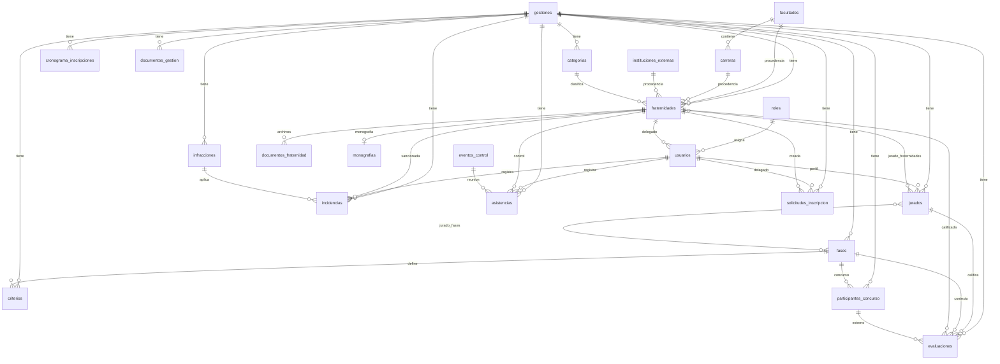

# Entrada Universitaria (EFU) — Diccionario y Esquema de Base de Datos

Documentación generada a partir de las **26 entidades TypeORM** en `backend/src/entities/` (+ 2 tablas junction).

- **Motor:** PostgreSQL  
- **Base de datos:** `efu_db` (configurable vía `.env`)  
- **ORM:** TypeORM (`synchronize` según entorno; en producción se usan patches idempotentes en `ensureSchemaPatches`)  
- **Última revisión:** 30 julio 2026  

---

## Consideraciones generales

### Alcance por gestión vs. global

| Tipo | Tablas |
|------|--------|
| **Globales** (no dependen del año) | `roles`, `facultades`, `carreras`, `instituciones_externas`, `tipos_danza`, `usuarios`, `eventos_control`, `password_reset_tokens` |
| **Por gestión** (año del evento) | `gestiones`, `categorias`, `fraternidades`, `fases`, `criterios`, `jurados`, `evaluaciones`, `participantes_concurso`, `infracciones`, `incidencias`, `asistencias`, `solicitudes_inscripcion`, `cronograma_inscripciones`, `documentos_gestion`, `sesiones_usuario` (opcional), `auditoria_acciones` (opcional) |
| **Por fraternidad** | `documentos_fraternidad`, `monografias` |
| **Auditoría / sesiones** | `sesiones_usuario`, `auditoria_acciones` (pueden ser globales si `id_gestion` es NULL: usuarios, organización, mail) |

### Reglas de negocio relevantes (aplicación)

- Solo puede existir **un usuario con rol `delegado` por fraternidad** (validado en `UsuariosService`).
- Los textos de **solicitudes de inscripción** (nombres, fraternidad, directiva) se persisten en **MAYÚSCULAS**.
- **Preinscripción — directiva:** cada cargo tiene nombres, apellidos, CI y complemento SEGIP opcional; cargos obligatorios vs opcionales según reglamento.
- **Preinscripción — documentos:** **4 PDFs por integrante** (CI, Matrícula, No deudas fraternidad, No deudas áreas). Sin certificados globales de deuda. **3 PDFs institucionales** globales (carta, resolución, acta).
- Al **aprobar** una solicitud se crea o reutiliza la fraternidad oficial y se vincula al delegado.
- **Directorio de delegados:** solo delegado **titular** y **suplente** (datos en `solicitudes_inscripcion`).
- **Monografía:** cada fraternidad sube **un único PDF** vía su delegado (`uploads/Doc_Monografia/`). Admin/jurado/superusuario la consultan al calificar; el rol **`veedor`** (solo lectura) lista fraternidades y ve/descarga la monografía real subida. Si no hay fila en `monografias`, se informa que aún no subieron.
- **DELETE físico:** las eliminaciones en organización (facultad/carrera/institución) borran filas de la BD (hard delete); no hay soft-delete. Las facultades eliminan carreras en cascada (`ON DELETE CASCADE`).
- **Asistencia:** basta con que asista titular o suplente; si ninguno asiste → incidencia de −10 pts en disciplina.
- **Rol `veedor`:** acceso de solo lectura a Estadísticas, Reglamento y listado de monografías. Sin permisos de escritura, calificación, reportes, gestión de usuarios ni ajustes.

### Diagrama de relaciones (resumen)


```mermaid
erDiagram
    gestiones ||--o{ categorias : tiene
    gestiones ||--o{ fraternidades : tiene
    gestiones ||--o{ fases : tiene
    gestiones ||--o{ criterios : tiene
    gestiones ||--o{ jurados : tiene
    gestiones ||--o{ evaluaciones : tiene
    gestiones ||--o{ participantes_concurso : tiene
    gestiones ||--o{ infracciones : tiene
    gestiones ||--o{ incidencias : tiene
    gestiones ||--o{ asistencias : tiene
    gestiones ||--o{ solicitudes_inscripcion : tiene
    gestiones ||--o{ cronograma_inscripciones : tiene
    gestiones ||--o{ documentos_gestion : tiene

    roles ||--o{ usuarios : asigna
    fraternidades ||--o{ usuarios : delegado
    facultades ||--o{ carreras : contiene
    facultades ||--o{ fraternidades : procedencia
    carreras ||--o{ fraternidades : procedencia
    instituciones_externas ||--o{ fraternidades : procedencia
    categorias ||--o{ fraternidades : clasifica

    usuarios ||--o{ jurados : perfil
    usuarios ||--o{ solicitudes_inscripcion : delegado
    usuarios ||--o{ incidencias : registra
    usuarios ||--o{ asistencias : registra

    jurados }o--o{ fases : jurado_fases
    jurados }o--o{ fraternidades : jurado_fraternidades
    jurados ||--o{ evaluaciones : califica

    fases ||--o{ criterios : define
    fases ||--o{ evaluaciones : contexto
    fases ||--o{ participantes_concurso : concurso

    fraternidades ||--o{ evaluaciones : calificada
    fraternidades ||--o{ incidencias : sancionada
    fraternidades ||--o{ asistencias : control
    fraternidades ||--o{ documentos_fraternidad : archivos
    fraternidades ||--o| monografias : monografia
    fraternidades ||--o{ solicitudes_inscripcion : creada

    infracciones ||--o{ incidencias : aplica
    eventos_control ||--o{ asistencias : reunion
    participantes_concurso ||--o{ evaluaciones : externo
```

---

## 1. Módulo organizacional (global)

### `facultades`

Facultades de la UMSA.

| Columna | Tipo | Restricciones | Descripción |
|---------|------|---------------|-------------|
| `id_facultad` | SERIAL | PK | Identificador |
| `nombre` | VARCHAR(255) | NOT NULL, UNIQUE | Nombre completo |
| `sigla` | VARCHAR(20) | NULL | Sigla (ej. FCPN) |
| `created_at` | TIMESTAMP | NOT NULL | Creación |
| `updated_at` | TIMESTAMP | NOT NULL | Actualización |

### `carreras`

| Columna | Tipo | Restricciones | Descripción |
|---------|------|---------------|-------------|
| `id_carrera` | SERIAL | PK | Identificador |
| `id_facultad` | INTEGER | FK → `facultades`, ON DELETE CASCADE | Facultad padre |
| `nombre` | VARCHAR(255) | NOT NULL | Nombre de la carrera |
| `created_at` | TIMESTAMP | NOT NULL | Creación |
| `updated_at` | TIMESTAMP | NOT NULL | Actualización |

### `instituciones_externas`

| Columna | Tipo | Restricciones | Descripción |
|---------|------|---------------|-------------|
| `id_institucion` | SERIAL | PK | Identificador |
| `nombre` | VARCHAR(255) | NOT NULL, UNIQUE | Nombre |
| `sigla` | VARCHAR(20) | NULL | Sigla |
| `tipo_institucion` | VARCHAR(100) | NULL | Clasificación |
| `created_at` | TIMESTAMP | NOT NULL | Creación |
| `updated_at` | TIMESTAMP | NOT NULL | Actualización |

---

## 2. Módulo de gestión (año del evento)

### `gestiones`

Configuración central de cada año EFU.

| Columna | Tipo | Restricciones | Descripción |
|---------|------|---------------|-------------|
| `id_gestion` | SERIAL | PK | Identificador |
| `anio` | INTEGER | NOT NULL, UNIQUE | Año (ej. 2026) |
| `edicion` | VARCHAR(20) | NULL | Etiqueta de edición (ej. XXXI) |
| `lema` | TEXT | NULL | Lema del evento |
| `activa` | BOOLEAN | DEFAULT false | Gestión en curso |
| `nombre_sitio` | VARCHAR(255) | NULL | Nombre público del sitio |
| `titulo_principal` | VARCHAR(255) | NULL | Título landing |
| `subtitulo_principal` | TEXT | NULL | Subtítulo landing |
| `url_banner` | VARCHAR(500) | NULL | Banner |
| `url_logo` | VARCHAR(500) | NULL | Logo |
| `url_imagen_login` | VARCHAR(500) | NULL | Imagen login |
| `url_mapa_ubicacion` | VARCHAR(500) | NULL | URL embed del mapa de recorrido (Google My Maps) en el landing |
| `modo_mantenimiento` | BOOLEAN | DEFAULT false | Sitio en mantenimiento |
| `mostrar_ranking` | BOOLEAN | DEFAULT true | Mostrar ranking público |
| `mostrar_historico` | BOOLEAN | DEFAULT false | Mostrar archivo histórico en landing |
| `permite_inscripcion_publica` | BOOLEAN | DEFAULT false | Registro público delegados |
| `limite_fraternidades_por_danza` | INTEGER | DEFAULT 6 | Cupo máximo por tipo de danza; el exceso se marca `es_excedente` |
| `landing_fraternidades` | JSONB | NULL | Tarjetas destacadas del landing (`titulo`, `subtitulo`, `descripcion`, `urlImagen`) |
| `created_at` | TIMESTAMP | NOT NULL | Creación |
| `updated_at` | TIMESTAMP | NOT NULL | Actualización |

### `categorias`

Categorías de danza por gestión (A, B, C, etc.).

| Columna | Tipo | Restricciones | Descripción |
|---------|------|---------------|-------------|
| `id_categoria` | SERIAL | PK | Identificador |
| `id_gestion` | INTEGER | FK → `gestiones`, ON DELETE CASCADE | Gestión |
| `nombre` | VARCHAR(50) | NOT NULL | Nombre categoría |
| `descripcion` | TEXT | NULL | Definición reglamentaria |
| `created_at` | TIMESTAMP | NOT NULL | Creación |
| `updated_at` | TIMESTAMP | NOT NULL | Actualización |

### `cronograma_inscripciones`

Ventanas de inscripción por categoría.

| Columna | Tipo | Restricciones | Descripción |
|---------|------|---------------|-------------|
| `id_cronograma` | SERIAL | PK | Identificador |
| `id_gestion` | INTEGER | FK → `gestiones` | Gestión |
| `id_categoria` | INTEGER | FK → `categorias` | Categoría |
| `fecha_inicio` | TIMESTAMP | NOT NULL | Inicio inscripción |
| `fecha_fin` | TIMESTAMP | NOT NULL | Fin inscripción |
| `created_at` | TIMESTAMP | NOT NULL | Creación |
| `updated_at` | TIMESTAMP | NOT NULL | Actualización |

### `documentos_gestion`

Reglamentos y PDFs institucionales por gestión.

| Columna | Tipo | Restricciones | Descripción |
|---------|------|---------------|-------------|
| `id_documento` | SERIAL | PK | Identificador |
| `titulo` | VARCHAR(255) | NOT NULL | Título |
| `descripcion` | TEXT | NULL | Descripción |
| `tipo` | VARCHAR(100) | DEFAULT 'otro' | Tipo (reglamento_efu, etc.) |
| `url_pdf` | VARCHAR(500) | NOT NULL | Ruta del PDF |
| `orden` | INTEGER | DEFAULT 0 | Orden de visualización |
| `id_gestion` | INTEGER | FK → `gestiones`, ON DELETE CASCADE | Gestión |
| `created_at` | TIMESTAMP | NOT NULL | Creación |

---

## 3. Módulo fraternidades

### `fraternidades`

Participación oficial de un grupo folclórico en una gestión.

| Columna | Tipo | Restricciones | Descripción |
|---------|------|---------------|-------------|
| `id_fraternidad` | SERIAL | PK | Identificador |
| `nombre` | VARCHAR(255) | NOT NULL, **UNIQUE** | Nombre (único global) |
| `nivel_representacion` | VARCHAR(100) | NULL | Facultad, Carrera, UMSA, Externo, etc. |
| `id_gestion` | INTEGER | FK → `gestiones`, ON DELETE CASCADE | Gestión |
| `id_facultad` | INTEGER | FK → `facultades`, ON DELETE SET NULL | Facultad |
| `id_carrera` | INTEGER | FK → `carreras`, ON DELETE SET NULL | Carrera |
| `id_institucion_externa` | INTEGER | FK → `instituciones_externas`, ON DELETE SET NULL | Institución externa |
| `id_categoria` | INTEGER | FK → `categorias` | Categoría de concurso |
| `id_tipo_danza` | INTEGER | FK → `tipos_danza`, NULL | Tipo de danza |
| `tipo_organizacion` | VARCHAR(100) | NULL | Tipo organizacional |
| `fecha_fundacion` | DATE | NULL | Fecha fundación |
| `habilitado_efu` | BOOLEAN | DEFAULT true | Habilitada para EFU |
| `es_excedente` | BOOLEAN | DEFAULT false | Superó el límite de fraternidades por tipo de danza (sigue aceptada) |
| `logo_url` | TEXT | NULL | URL del logo |
| `promedio_base` | NUMERIC(5,2) | DEFAULT 0 | Promedio base |
| `costos_participacion` | JSONB | NULL | Costos por bailarín `{ multiple, items: [{ concepto, monto }] }` (copiado al aprobar) |
| `created_at` | TIMESTAMP | NOT NULL | Creación |
| `updated_at` | TIMESTAMP | NOT NULL | Actualización |

### `documentos_fraternidad`

| Columna | Tipo | Restricciones | Descripción |
|---------|------|---------------|-------------|
| `id_documento` | SERIAL | PK | Identificador |
| `id_fraternidad` | INTEGER | FK → `fraternidades` | Fraternidad |
| `tipo_documento` | VARCHAR(50) | NOT NULL | Tipo de documento |
| `url_archivo` | VARCHAR(500) | NOT NULL | Ruta del archivo |
| `fecha_subida` | TIMESTAMP | NOT NULL | Fecha de subida |

### `monografias`

Monografía única por fraternidad, subida por el delegado. Archivo en `uploads/Doc_Monografia/`.

| Columna | Tipo | Restricciones | Descripción |
|---------|------|---------------|-------------|
| `id_monografia` | SERIAL | PK | Identificador |
| `id_fraternidad` | INTEGER | FK → `fraternidades`, **UNIQUE** | Fraternidad (1:1) |
| `url_archivo` | VARCHAR(500) | NOT NULL | Ruta del PDF |
| `nombre_archivo` | VARCHAR(255) | NULL | Nombre original del archivo |
| `id_usuario_subio` | INTEGER | FK → `usuarios`, NULL | Delegado que subió |
| `fecha_subida` | TIMESTAMP | NOT NULL | Primera subida |
| `updated_at` | TIMESTAMP | NOT NULL | Última actualización |

**Reglas:** una fraternidad solo puede tener una monografía; solo el delegado asignado puede subirla o reemplazarla; admin, jurado, superusuario y **veedor** pueden consultarla. El listado `GET /monografias/listado-fraternidades` (veedor/admin/superusuario) incluye el estado `tieneMonografia` y los metadatos del PDF realmente subido.

---

## 4. Módulo inscripción / preinscripción

### `solicitudes_inscripcion`

Formulario de preinscripción enviado por el delegado antes de la inscripción oficial.

**Enums:**

- `estado`: `BORRADOR` | `PENDIENTE` | `OBSERVADO` | `APROBADO` | `RECHAZADO`
- `instancia_representacion`: `Facultad` | `Carrera` | `UMSA` | `FEDSIDUMSA` | `STUMSA` | `Externo`

**Borrador:** el delegado puede guardar progreso automático (`BORRADOR`) sin enviar a revisión. Los listados de la comisión excluyen `BORRADOR`.

#### Datos generales

| Columna | Tipo | Descripción |
|---------|------|-------------|
| `id_solicitud` | SERIAL PK | Identificador |
| `id_gestion` | FK → `gestiones` | Gestión |
| `id_usuario_delegado` | FK → `usuarios` | Usuario delegado |
| `nombre_fraternidad` | VARCHAR(255) | Nombre solicitado (MAYÚSCULAS) |
| `instancia_representacion` | ENUM | Nivel de representación |
| `id_facultad` | FK nullable | Facultad |
| `id_carrera` | FK nullable | Carrera |
| `id_institucion_externa` | FK nullable | Institución externa (catálogo) |
| `nombre_institucion_externa` | VARCHAR(255) | Nombre libre si es externo |
| `id_categoria` | FK → `categorias` nullable | Categoría A/B/C (nullable en BORRADOR) |
| `id_tipo_danza` | FK → `tipos_danza` | Tipo de danza |
| `costos_participacion` | JSONB nullable | Costos por bailarín: `{ multiple: bool, items: [{ concepto, monto }] }`. Obligatorio al enviar (estado ≠ BORRADOR). |

#### Directiva (10 cargos)

Por cada prefijo (`presi`, `vice`, `secGen`, `secHaci`, `secActas`, `secPrensa`, `vocal`, `delCogob`, `delTitular`, `delSuplente`):

| Sufijo columna | Descripción |
|----------------|-------------|
| `{prefix}_nombres` | Nombres |
| `{prefix}_primer_apellido` | Apellido paterno |
| `{prefix}_segundo_apellido` | Apellido materno |
| `{prefix}_ci` | Carnet de identidad |
| `{prefix}_ci_complemento` | Complemento SEGIP (ej. `-1A`) |
| `{prefix}_celular` | Celular (solo cargos con celular: presi, vice, delCogob, delTitular, delSuplente) |

**Cargos obligatorios:** Presidente, Vicepresidente, Secretario de Hacienda, Delegado Titular, Delegado Suplente.  
**Cargos opcionales:** Secretario General, Secretario de Actas, Secretario de Prensa, Vocal, **Delegado a Co-Gobierno**.  
**Cargos opcionales:** Secretario General, Secretario de Actas, Secretario de Prensa, Vocal.

#### Documentos PDF

**4 PDFs por integrante** (prefijos de archivo multer / columnas URL):

| Tipo | fileKey (ej. Presidente) | Columna URL |
|------|--------------------------|-------------|
| CI | `ciPresi` | `url_ci_presi` |
| Matrícula | `matriculaPresi` | `url_matricula_presi` |
| No deudas fraternidad | `sinDeudasFraternidadPresi` | `url_sin_deudas_fraternidad_presi` |
| No deudas áreas | `sinDeudasAreasPresi` | `url_sin_deudas_areas_presi` |

Mismo patrón para los 10 cargos (`Vice`, `SecGen`, `SecHaci`, `SecActas`, `SecPrensa`, `Vocal`, `DelCogob`, `DelTitular`, `DelSuplente`).  
**Total:** 40 columnas URL por persona + 3 institucionales.

**Documentos institucionales (globales, una vez por solicitud):**

| fileKey | Columna | Punto reglamento |
|---------|---------|------------------|
| `cartaCompromiso` | `url_carta_compromiso` | 31 |
| `resolucion` | `url_resolucion` | 32 |
| `actaDirectiva` | `url_acta_directiva` | 33 |

**Eliminados del modelo actual:** `url_ci_matricula_*` (PDF combinado), `url_sin_deudas_fraternidad` y `url_sin_deudas_areas` globales.

#### Control administrativo

| Columna | Tipo | Descripción |
|---------|------|-------------|
| `estado` | ENUM | Estado administrativo |
| `observaciones` | TEXT | Observaciones del admin |
| `revision_checklist` | JSONB | Checklist `{ key: { estado: PENDIENTE\|OK\|X, label, value, comentario? } }`. Keys unificadas: `{Cargo}-nombres`, `{Cargo}-ci`, `ciPresi`, `costosParticipacion`, `tipoDanza`, etc. |
| `id_fraternidad_creada` | FK nullable → `fraternidades` | Fraternidad oficial al aprobar |
| `created_at`, `updated_at` | TIMESTAMP | Auditoría |

**Nota:** la directiva y sus PDFs viven en la solicitud; la tabla `fraternidades` no replica la directiva ni los documentos de preinscripción.

---

## 5. Módulo usuarios y roles

### `roles`

| Columna | Tipo | Restricciones | Descripción |
|---------|------|---------------|-------------|
| `id_rol` | SERIAL | PK | Identificador |
| `nombre` | VARCHAR(100) | NOT NULL, UNIQUE | `superusuario`, `admin`, `controladorhcu`, `delegado`, `jurado`, `veedor` |
| `descripcion` | TEXT | NULL | Descripción del rol |
| `created_at`, `updated_at` | TIMESTAMP | NOT NULL | Auditoría |

### `usuarios`

| Columna | Tipo | Restricciones | Descripción |
|---------|------|---------------|-------------|
| `id_usuario` | SERIAL | PK | Identificador |
| `id_rol` | INTEGER | FK → `roles` | Rol del usuario |
| `ci` | VARCHAR(20) | NOT NULL, UNIQUE | Carnet de identidad (login) |
| `nombres` | VARCHAR(150) | NOT NULL | Nombres |
| `primer_apellido` | VARCHAR(100) | NOT NULL | Primer apellido |
| `segundo_apellido` | VARCHAR(100) | NULL | Segundo apellido |
| `correo` | VARCHAR(255) | UNIQUE, NULL | Correo electrónico (obligatorio en usuarios nuevos; legacy puede ser NULL) |
| `password` | VARCHAR(255) | NOT NULL | Hash bcrypt |
| `id_fraternidad` | INTEGER | FK nullable → `fraternidades` | Fraternidad del delegado |
| `primer_login` | BOOLEAN | DEFAULT true | Forzar cambio de contraseña |
| `created_at`, `updated_at` | TIMESTAMP | NOT NULL | Auditoría |

### `password_reset_tokens`

Tokens OTP para recuperación de contraseña.

| Columna | Tipo | Restricciones | Descripción |
|---------|------|---------------|-------------|
| `id_token` | SERIAL | PK | Identificador |
| `id_usuario` | INTEGER | FK → `usuarios`, ON DELETE CASCADE | Usuario |
| `code_hash` | VARCHAR(255) | NOT NULL | Hash bcrypt del código OTP de 6 dígitos |
| `expires_at` | TIMESTAMP | NOT NULL | Expiración (15 minutos) |
| `attempts` | INTEGER | DEFAULT 0 | Intentos fallidos de verificación (máx. 5) |
| `used_at` | TIMESTAMP | NULL | Fecha de consumo del token |
| `reset_session_id` | VARCHAR(64) | NULL | Sesión de un solo uso para JWT de reset |
| `created_at` | TIMESTAMP | NOT NULL | Auditoría / rate limit (3 solicitudes/hora) |

### `sesiones_usuario`

Registro de inicios de sesión (auditoría). Una sesión se cierra en logout o al abrir una nueva sesión del mismo usuario.

| Columna | Tipo | Restricciones | Descripción |
|---------|------|---------------|-------------|
| `id_sesion` | SERIAL | PK | Identificador |
| `id_usuario` | INTEGER | FK → `usuarios`, ON DELETE CASCADE | Usuario |
| `id_gestion` | INTEGER | FK → `gestiones`, ON DELETE SET NULL, NULL | Gestión activa al iniciar (o NULL) |
| `inicio_sesion` | TIMESTAMP | DEFAULT CURRENT_TIMESTAMP | Inicio |
| `fin_sesion` | TIMESTAMP | NULL | Cierre (`NULL` = activa) |
| `ip_address` | VARCHAR(45) | NULL | IP |
| `user_agent` | TEXT | NULL | Navegador |
| `created_at` | TIMESTAMP | NOT NULL | Auditoría |

### `auditoria_acciones`

Mutaciones HTTP (POST/PUT/PATCH/DELETE) registradas por `AuditInterceptor`. Módulos globales (`usuarios`, `organizacion`, `mail`, `auth`) quedan con `id_gestion` NULL (“Sistema global”).

| Columna | Tipo | Restricciones | Descripción |
|---------|------|---------------|-------------|
| `id_registro` | SERIAL | PK | Identificador |
| `id_sesion` | INTEGER | FK → `sesiones_usuario`, ON DELETE SET NULL | Sesión |
| `id_usuario` | INTEGER | FK → `usuarios`, ON DELETE SET NULL | Quién ejecutó |
| `id_gestion` | INTEGER | FK → `gestiones`, ON DELETE SET NULL | Gestión o NULL (global) |
| `metodo` | VARCHAR(10) | NOT NULL | POST / PUT / PATCH / DELETE |
| `ruta` | VARCHAR(500) | NOT NULL | Path API |
| `modulo` | VARCHAR(100) | NULL | Primer segmento de ruta |
| `descripcion` | TEXT | NULL | Texto legible de la acción |
| `cuerpo_solicitud` | JSONB | NULL | Payload sanitizado (+ respuesta en DELETE organizacion) |
| `codigo_respuesta` | INTEGER | NULL | HTTP status 2xx |
| `created_at` | TIMESTAMP | NOT NULL | Momento |

**Índices:** `created_at`, `modulo`.

---

## 6. Módulo evaluaciones

### `fases`

| Columna | Tipo | Descripción |
|---------|------|-------------|
| `id_fase` | SERIAL PK | Identificador |
| `id_gestion` | FK → `gestiones` | Gestión |
| `nombre` | VARCHAR(255) | Nombre (Monografía, Entrada, etc.) |
| `peso_porcentaje` | NUMERIC(5,2) | Peso en nota final EFU |
| `tipo_concurso` | VARCHAR(50) | `EFU` o `EXTERNO` |
| `categoria_efu` | VARCHAR(50) | Subcategoría EFU (MONOGRAFIA, DANZA, etc.) |
| `es_precalificacion` | BOOLEAN | Es fase de precalificación |
| `fecha_inicio`, `fecha_fin` | TIMESTAMP | Ventana de evaluación |
| `esta_activa` | BOOLEAN | Fase habilitada |
| `url_imagen` | VARCHAR(500) | Imagen de la fase |
| `created_at`, `updated_at` | TIMESTAMP | Auditoría |

### `criterios`

| Columna | Tipo | Descripción |
|---------|------|-------------|
| `id_criterio` | SERIAL PK | Identificador |
| `id_gestion` | FK, ON DELETE CASCADE | Gestión |
| `id_fase` | FK → `fases` | Fase |
| `nombre` | VARCHAR(255) | Nombre del criterio |
| `puntaje_maximo` | NUMERIC(5,2) | Puntaje máximo |
| `url_imagen` | VARCHAR(500) | Imagen ilustrativa |
| `created_at`, `updated_at` | TIMESTAMP | Auditoría |

### `jurados`

Perfil de calificador vinculado a un usuario.

| Columna | Tipo | Descripción |
|---------|------|-------------|
| `id_jurado` | SERIAL PK | Identificador |
| `id_usuario` | FK → `usuarios` | Usuario |
| `id_gestion` | FK → `gestiones` | Gestión |
| `tipo_origen` | VARCHAR(100) | Origen del perfil |
| `tipo_jurado` | VARCHAR(20) | `EFU`, `EXTERNO`, `AMBOS` |
| `id_carrera` | FK nullable | Carrera (si aplica) |
| `institucion_externa` | VARCHAR(255) | Texto libre |
| `created_at`, `updated_at` | TIMESTAMP | Auditoría |

### `jurado_fases` (tabla intermedia M:N)

| Columna | Tipo | Descripción |
|---------|------|-------------|
| `id_jurado` | FK → `jurados` | Jurado |
| `id_fase` | FK → `fases` | Fase habilitada |

### `jurado_fraternidades` (tabla intermedia M:N)

| Columna | Tipo | Descripción |
|---------|------|-------------|
| `id_jurado` | FK → `jurados` | Jurado |
| `id_fraternidad` | FK → `fraternidades` | Fraternidad restringida (vacío = todas) |

### `evaluaciones`

| Columna | Tipo | Descripción |
|---------|------|-------------|
| `id_evaluacion` | SERIAL PK | Identificador |
| `id_gestion` | FK → `gestiones` | Gestión |
| `id_jurado` | FK → `jurados` | Jurado calificador |
| `id_fraternidad` | FK nullable | Fraternidad (EFU) |
| `id_fase` | FK → `fases` | Fase |
| `id_participante` | FK nullable → `participantes_concurso` | Participante (EXTERNO) |
| `estado` | ENUM | `PENDIENTE`, `EN_PROGRESO`, `COMPLETADO` |
| `criterios_evaluados` | JSONB | Detalle por criterio |
| `puntaje_total` | NUMERIC(5,2) | Puntaje total |
| `fecha_apertura`, `fecha_cierre` | TIMESTAMP | Ventana de calificación |
| `created_at`, `updated_at` | TIMESTAMP | Auditoría |

---

## 7. Módulo participantes (concursos externos)

### `participantes_concurso`

| Columna | Tipo | Descripción |
|---------|------|-------------|
| `id_participante` | SERIAL PK | Identificador |
| `id_gestion` | FK, ON DELETE CASCADE | Gestión |
| `nombre` | VARCHAR(255) | Nombre completo |
| `tipo` | VARCHAR(100) | Chacha, Warmi, Fotógrafo, etc. |
| `es_umsa` | BOOLEAN | Procede de UMSA |
| `id_facultad`, `id_carrera` | FK nullable | Procedencia UMSA |
| `institucion_externa` | VARCHAR(255) | Procedencia externa |
| `pertenece_fraternidad` | BOOLEAN | Vinculado a fraternidad |
| `id_fraternidad` | FK nullable | Fraternidad |
| `id_fase` | FK → `fases`, ON DELETE CASCADE | Concurso externo |
| `created_at`, `updated_at` | TIMESTAMP | Auditoría |

---

## 8. Módulo disciplina e incidencias

### `infracciones`

Catálogo de sanciones por gestión.

| Columna | Tipo | Descripción |
|---------|------|-------------|
| `id_infraccion` | SERIAL PK | Identificador |
| `id_gestion` | FK → `gestiones` | Gestión |
| `nombre` | VARCHAR(255) | Nombre (ej. INASISTENCIA DE DELEGADO) |
| `tipo_impacto` | VARCHAR(100) | Ej. DESCUENTO_DISCIPLINA, RESTA_PUNTOS |
| `valor_impacto` | NUMERIC(5,2) | Valor (negativo = descuento) |
| `created_at`, `updated_at` | TIMESTAMP | Auditoría |

### `incidencias`

Registro de sanciones aplicadas a una fraternidad.

| Columna | Tipo | Descripción |
|---------|------|-------------|
| `id_incidencia` | SERIAL PK | Identificador |
| `id_gestion` | FK → `gestiones` | Gestión |
| `id_fraternidad` | FK → `fraternidades` | Fraternidad sancionada |
| `id_usuario` | FK → `usuarios` | Usuario que registra |
| `id_infraccion` | FK → `infracciones` | Tipo de infracción |
| `fecha_hora` | TIMESTAMP | Fecha del hecho |
| `observacion` | TEXT | Detalle |
| `created_at`, `updated_at` | TIMESTAMP | Auditoría |

---

## 9. Módulo asistencia de delegados

### `eventos_control`

Reuniones / eventos de control (global, no por gestión en entidad actual).

| Columna | Tipo | Descripción |
|---------|------|-------------|
| `id_evento` | SERIAL PK | Identificador |
| `nombre` | VARCHAR(255) | Nombre del evento |
| `fecha_hora` | TIMESTAMP | Fecha y hora |
| `ubicacion` | VARCHAR(500) | Lugar (opcional) |
| `descripcion` | TEXT | Detalle / citación |
| `es_publico` | BOOLEAN DEFAULT false | Visible en landing; si false, solo citación a delegados |
| `puntos_penalizacion` | NUMERIC(5,2) DEFAULT 3 | Penalización por inasistencia |
| `created_at`, `updated_at` | TIMESTAMP | Auditoría |

### `asistencias`

Registro de asistencia por fraternidad y evento.

| Columna | Tipo | Descripción |
|---------|------|-------------|
| `id_asistencia` | SERIAL PK | Identificador |
| `id_gestion` | FK → `gestiones` | Gestión |
| `id_fraternidad` | FK → `fraternidades` | Fraternidad |
| `id_usuario` | FK → `usuarios` | Controlador que registra |
| `id_evento` | FK → `eventos_control` | Evento |
| `asistio` | BOOLEAN | Presente (titular o suplente) |
| `observaciones` | TEXT | Detalle titular/suplente |
| `created_at`, `updated_at` | TIMESTAMP | Auditoría |

---

## 10. Esquema SQL completo (PostgreSQL)

Script de referencia equivalente al modelo TypeORM actual.  
**Nota:** con `synchronize: true` TypeORM crea/altera estas estructuras automáticamente; use este SQL para documentación, migraciones manuales o entornos nuevos.

```sql
-- ============================================================
-- EFU — Esquema PostgreSQL
-- Base de datos: efu_db
-- ============================================================

-- Extensiones (opcional)
-- CREATE EXTENSION IF NOT EXISTS "uuid-ossp";

-- ------------------------------------------------------------
-- Tipos enumerados
-- ------------------------------------------------------------
DO $$ BEGIN
    CREATE TYPE estado_solicitud AS ENUM ('BORRADOR', 'PENDIENTE', 'OBSERVADO', 'APROBADO', 'RECHAZADO');
EXCEPTION WHEN duplicate_object THEN NULL; END $$;

DO $$ BEGIN
    CREATE TYPE instancia_representacion AS ENUM ('Facultad', 'Carrera', 'UMSA', 'FEDSIDUMSA', 'STUMSA', 'Externo');
EXCEPTION WHEN duplicate_object THEN NULL; END $$;

DO $$ BEGIN
    CREATE TYPE estado_evaluacion AS ENUM ('PENDIENTE', 'EN_PROGRESO', 'COMPLETADO');
EXCEPTION WHEN duplicate_object THEN NULL; END $$;

-- ------------------------------------------------------------
-- 1. Organización (global)
-- ------------------------------------------------------------
CREATE TABLE IF NOT EXISTS facultades (
    id_facultad     SERIAL PRIMARY KEY,
    nombre          VARCHAR(255) NOT NULL UNIQUE,
    sigla           VARCHAR(20),
    created_at      TIMESTAMP NOT NULL DEFAULT NOW(),
    updated_at      TIMESTAMP NOT NULL DEFAULT NOW()
);

CREATE TABLE IF NOT EXISTS carreras (
    id_carrera      SERIAL PRIMARY KEY,
    id_facultad     INTEGER NOT NULL REFERENCES facultades(id_facultad) ON DELETE CASCADE,
    nombre          VARCHAR(255) NOT NULL,
    created_at      TIMESTAMP NOT NULL DEFAULT NOW(),
    updated_at      TIMESTAMP NOT NULL DEFAULT NOW()
);

CREATE TABLE IF NOT EXISTS instituciones_externas (
    id_institucion      SERIAL PRIMARY KEY,
    nombre              VARCHAR(255) NOT NULL UNIQUE,
    sigla               VARCHAR(20),
    tipo_institucion    VARCHAR(100),
    created_at          TIMESTAMP NOT NULL DEFAULT NOW(),
    updated_at          TIMESTAMP NOT NULL DEFAULT NOW()
);

-- ------------------------------------------------------------
-- 2. Gestión
-- ------------------------------------------------------------
CREATE TABLE IF NOT EXISTS gestiones (
    id_gestion                  SERIAL PRIMARY KEY,
    anio                        INTEGER NOT NULL UNIQUE,
    lema                        TEXT,
    activa                      BOOLEAN NOT NULL DEFAULT FALSE,
    nombre_sitio                VARCHAR(255),
    titulo_principal            VARCHAR(255),
    subtitulo_principal         TEXT,
    url_banner                  VARCHAR(500),
    url_logo                    VARCHAR(500),
    url_imagen_login            VARCHAR(500),
    url_mapa_ubicacion          VARCHAR(500),
    modo_mantenimiento          BOOLEAN NOT NULL DEFAULT FALSE,
    mostrar_ranking             BOOLEAN NOT NULL DEFAULT TRUE,
    permite_inscripcion_publica BOOLEAN NOT NULL DEFAULT FALSE,
    created_at                  TIMESTAMP NOT NULL DEFAULT NOW(),
    updated_at                  TIMESTAMP NOT NULL DEFAULT NOW()
);

CREATE TABLE IF NOT EXISTS categorias (
    id_categoria    SERIAL PRIMARY KEY,
    id_gestion      INTEGER NOT NULL REFERENCES gestiones(id_gestion) ON DELETE CASCADE,
    nombre          VARCHAR(50) NOT NULL,
    descripcion     TEXT,
    created_at      TIMESTAMP NOT NULL DEFAULT NOW(),
    updated_at      TIMESTAMP NOT NULL DEFAULT NOW()
);

CREATE TABLE IF NOT EXISTS cronograma_inscripciones (
    id_cronograma   SERIAL PRIMARY KEY,
    id_gestion      INTEGER NOT NULL REFERENCES gestiones(id_gestion),
    id_categoria    INTEGER NOT NULL REFERENCES categorias(id_categoria),
    fecha_inicio    TIMESTAMP NOT NULL,
    fecha_fin       TIMESTAMP NOT NULL,
    created_at      TIMESTAMP NOT NULL DEFAULT NOW(),
    updated_at      TIMESTAMP NOT NULL DEFAULT NOW()
);

CREATE TABLE IF NOT EXISTS documentos_gestion (
    id_documento    SERIAL PRIMARY KEY,
    titulo          VARCHAR(255) NOT NULL,
    descripcion     TEXT,
    tipo            VARCHAR(100) NOT NULL DEFAULT 'otro',
    url_pdf         VARCHAR(500) NOT NULL,
    orden           INTEGER NOT NULL DEFAULT 0,
    id_gestion      INTEGER NOT NULL REFERENCES gestiones(id_gestion) ON DELETE CASCADE,
    created_at      TIMESTAMP NOT NULL DEFAULT NOW()
);

-- ------------------------------------------------------------
-- 3. Fraternidades
-- ------------------------------------------------------------
CREATE TABLE IF NOT EXISTS fraternidades (
    id_fraternidad          SERIAL PRIMARY KEY,
    nombre                  VARCHAR(255) NOT NULL UNIQUE,
    nivel_representacion    VARCHAR(100),
    id_gestion              INTEGER REFERENCES gestiones(id_gestion) ON DELETE CASCADE,
    id_facultad             INTEGER REFERENCES facultades(id_facultad) ON DELETE SET NULL,
    id_carrera              INTEGER REFERENCES carreras(id_carrera) ON DELETE SET NULL,
    id_institucion_externa  INTEGER REFERENCES instituciones_externas(id_institucion) ON DELETE SET NULL,
    id_categoria            INTEGER REFERENCES categorias(id_categoria),
    tipo_organizacion       VARCHAR(100),
    fecha_fundacion         DATE,
    habilitado_efu          BOOLEAN NOT NULL DEFAULT TRUE,
    logo_url                TEXT,
    promedio_base           NUMERIC(5,2) NOT NULL DEFAULT 0,
    costos_participacion    JSONB,
    created_at              TIMESTAMP NOT NULL DEFAULT NOW(),
    updated_at              TIMESTAMP NOT NULL DEFAULT NOW()
);

CREATE TABLE IF NOT EXISTS documentos_fraternidad (
    id_documento        SERIAL PRIMARY KEY,
    id_fraternidad      INTEGER NOT NULL REFERENCES fraternidades(id_fraternidad),
    tipo_documento      VARCHAR(50) NOT NULL,
    url_archivo         VARCHAR(500) NOT NULL,
    fecha_subida        TIMESTAMP NOT NULL DEFAULT NOW()
);

-- ------------------------------------------------------------
-- 4. Roles y usuarios
-- ------------------------------------------------------------
CREATE TABLE IF NOT EXISTS roles (
    id_rol          SERIAL PRIMARY KEY,
    nombre          VARCHAR(100) NOT NULL UNIQUE,
    descripcion     TEXT,
    created_at      TIMESTAMP NOT NULL DEFAULT NOW(),
    updated_at      TIMESTAMP NOT NULL DEFAULT NOW()
);

CREATE TABLE IF NOT EXISTS usuarios (
    id_usuario          SERIAL PRIMARY KEY,
    id_rol              INTEGER NOT NULL REFERENCES roles(id_rol),
    ci                  VARCHAR(20) NOT NULL UNIQUE,
    nombres             VARCHAR(150) NOT NULL,
    primer_apellido     VARCHAR(100) NOT NULL,
    segundo_apellido    VARCHAR(100),
    correo              VARCHAR(255) UNIQUE,
    password            VARCHAR(255) NOT NULL,
    id_fraternidad      INTEGER REFERENCES fraternidades(id_fraternidad) ON DELETE SET NULL,
    primer_login        BOOLEAN NOT NULL DEFAULT TRUE,
    created_at          TIMESTAMP NOT NULL DEFAULT NOW(),
    updated_at          TIMESTAMP NOT NULL DEFAULT NOW()
);

CREATE TABLE IF NOT EXISTS monografias (
    id_monografia       SERIAL PRIMARY KEY,
    id_fraternidad      INTEGER NOT NULL UNIQUE REFERENCES fraternidades(id_fraternidad) ON DELETE CASCADE,
    url_archivo         VARCHAR(500) NOT NULL,
    nombre_archivo      VARCHAR(255),
    id_usuario_subio    INTEGER REFERENCES usuarios(id_usuario) ON DELETE SET NULL,
    fecha_subida        TIMESTAMP NOT NULL DEFAULT NOW(),
    updated_at          TIMESTAMP NOT NULL DEFAULT NOW()
);

CREATE TABLE IF NOT EXISTS password_reset_tokens (
    id_token            SERIAL PRIMARY KEY,
    id_usuario          INTEGER NOT NULL REFERENCES usuarios(id_usuario) ON DELETE CASCADE,
    code_hash           VARCHAR(255) NOT NULL,
    expires_at          TIMESTAMP NOT NULL,
    attempts            INTEGER NOT NULL DEFAULT 0,
    used_at             TIMESTAMP,
    reset_session_id    VARCHAR(64),
    created_at          TIMESTAMP NOT NULL DEFAULT NOW()
);

-- ------------------------------------------------------------
-- 5. Solicitudes de inscripción (esquema resumido; ver sección 4 para convención de columnas)
-- ------------------------------------------------------------
CREATE TABLE IF NOT EXISTS solicitudes_inscripcion (
    id_solicitud                    SERIAL PRIMARY KEY,
    id_gestion                      INTEGER NOT NULL REFERENCES gestiones(id_gestion),
    id_usuario_delegado             INTEGER NOT NULL REFERENCES usuarios(id_usuario),
    nombre_fraternidad              VARCHAR(255) NOT NULL,
    instancia_representacion        instancia_representacion NOT NULL,
    id_facultad                     INTEGER REFERENCES facultades(id_facultad),
    id_carrera                      INTEGER REFERENCES carreras(id_carrera),
    id_institucion_externa          INTEGER REFERENCES instituciones_externas(id_institucion),
    nombre_institucion_externa      VARCHAR(255),
    id_categoria                    INTEGER NOT NULL REFERENCES categorias(id_categoria),
    id_tipo_danza                   INTEGER REFERENCES tipos_danza(id_tipo_danza),
    costos_participacion            JSONB,
    -- Directiva: por cada cargo → {prefix}_nombres, _primer_apellido, _segundo_apellido,
    --            _ci, _ci_complemento, _celular (ver prefijos en sección 4)
    presi_nombres                   VARCHAR(150),
    presi_primer_apellido           VARCHAR(100),
    presi_segundo_apellido          VARCHAR(100),
    presi_ci                        VARCHAR(50),
    presi_ci_complemento            VARCHAR(10),
    presi_celular                   VARCHAR(50),
    -- ... (vice, sec_gen, sec_haci, sec_actas, sec_prensa, vocal, del_cogob, del_titular, del_suplente)
    -- Documentos: 4 URLs por cargo (url_ci_*, url_matricula_*, url_sin_deudas_fraternidad_*, url_sin_deudas_areas_*)
    url_ci_presi                    VARCHAR(500),
    url_matricula_presi             VARCHAR(500),
    url_sin_deudas_fraternidad_presi VARCHAR(500),
    url_sin_deudas_areas_presi      VARCHAR(500),
    -- ... (mismo patrón × 10 cargos = 40 columnas)
    url_carta_compromiso            VARCHAR(500),
    url_resolucion                  VARCHAR(500),
    url_acta_directiva              VARCHAR(500),
    estado                          estado_solicitud NOT NULL DEFAULT 'PENDIENTE',
    observaciones                   TEXT,
    revision_checklist              JSONB DEFAULT '{}'::jsonb,
    id_fraternidad_creada           INTEGER REFERENCES fraternidades(id_fraternidad) ON DELETE SET NULL,
    created_at                      TIMESTAMP NOT NULL DEFAULT NOW(),
    updated_at                      TIMESTAMP NOT NULL DEFAULT NOW()
);

-- ------------------------------------------------------------
-- 6. Fases, criterios y evaluaciones
-- ------------------------------------------------------------
CREATE TABLE IF NOT EXISTS fases (
    id_fase             SERIAL PRIMARY KEY,
    id_gestion          INTEGER NOT NULL REFERENCES gestiones(id_gestion),
    nombre              VARCHAR(255) NOT NULL,
    peso_porcentaje     NUMERIC(5,2) NOT NULL,
    tipo_concurso       VARCHAR(50) NOT NULL DEFAULT 'EFU',
    categoria_efu       VARCHAR(50),
    es_precalificacion  BOOLEAN NOT NULL DEFAULT FALSE,
    fecha_inicio        TIMESTAMP,
    fecha_fin           TIMESTAMP,
    esta_activa         BOOLEAN NOT NULL DEFAULT FALSE,
    url_imagen          VARCHAR(500),
    created_at          TIMESTAMP NOT NULL DEFAULT NOW(),
    updated_at          TIMESTAMP NOT NULL DEFAULT NOW()
);

CREATE TABLE IF NOT EXISTS criterios (
    id_criterio     SERIAL PRIMARY KEY,
    id_gestion      INTEGER NOT NULL REFERENCES gestiones(id_gestion) ON DELETE CASCADE,
    id_fase         INTEGER NOT NULL REFERENCES fases(id_fase),
    nombre          VARCHAR(255) NOT NULL,
    puntaje_maximo  NUMERIC(5,2) NOT NULL,
    url_imagen      VARCHAR(500),
    created_at      TIMESTAMP NOT NULL DEFAULT NOW(),
    updated_at      TIMESTAMP NOT NULL DEFAULT NOW()
);

CREATE TABLE IF NOT EXISTS jurados (
    id_jurado           SERIAL PRIMARY KEY,
    id_usuario          INTEGER NOT NULL REFERENCES usuarios(id_usuario),
    id_gestion          INTEGER NOT NULL REFERENCES gestiones(id_gestion),
    tipo_origen         VARCHAR(100),
    tipo_jurado         VARCHAR(20) NOT NULL DEFAULT 'EFU',
    id_carrera          INTEGER REFERENCES carreras(id_carrera) ON DELETE SET NULL,
    institucion_externa VARCHAR(255),
    created_at          TIMESTAMP NOT NULL DEFAULT NOW(),
    updated_at          TIMESTAMP NOT NULL DEFAULT NOW()
);

CREATE TABLE IF NOT EXISTS jurado_fases (
    id_jurado   INTEGER NOT NULL REFERENCES jurados(id_jurado) ON DELETE CASCADE,
    id_fase     INTEGER NOT NULL REFERENCES fases(id_fase) ON DELETE CASCADE,
    PRIMARY KEY (id_jurado, id_fase)
);

CREATE TABLE IF NOT EXISTS jurado_fraternidades (
    id_jurado       INTEGER NOT NULL REFERENCES jurados(id_jurado) ON DELETE CASCADE,
    id_fraternidad  INTEGER NOT NULL REFERENCES fraternidades(id_fraternidad) ON DELETE CASCADE,
    PRIMARY KEY (id_jurado, id_fraternidad)
);

CREATE TABLE IF NOT EXISTS evaluaciones (
    id_evaluacion       SERIAL PRIMARY KEY,
    id_gestion          INTEGER NOT NULL REFERENCES gestiones(id_gestion),
    id_jurado           INTEGER NOT NULL REFERENCES jurados(id_jurado),
    id_fraternidad      INTEGER REFERENCES fraternidades(id_fraternidad),
    id_fase             INTEGER NOT NULL REFERENCES fases(id_fase),
    id_participante     INTEGER,
    estado              estado_evaluacion NOT NULL DEFAULT 'PENDIENTE',
    criterios_evaluados JSONB,
    puntaje_total       NUMERIC(5,2) NOT NULL DEFAULT 0,
    fecha_apertura      TIMESTAMP,
    fecha_cierre        TIMESTAMP,
    created_at          TIMESTAMP NOT NULL DEFAULT NOW(),
    updated_at          TIMESTAMP NOT NULL DEFAULT NOW()
);

-- FK participante (tabla creada después)
-- ALTER TABLE evaluaciones ADD CONSTRAINT fk_eval_participante
--   FOREIGN KEY (id_participante) REFERENCES participantes_concurso(id_participante) ON DELETE SET NULL;

-- ------------------------------------------------------------
-- 7. Participantes concurso externo
-- ------------------------------------------------------------
CREATE TABLE IF NOT EXISTS participantes_concurso (
    id_participante         SERIAL PRIMARY KEY,
    id_gestion              INTEGER NOT NULL REFERENCES gestiones(id_gestion) ON DELETE CASCADE,
    nombre                  VARCHAR(255) NOT NULL,
    tipo                    VARCHAR(100),
    es_umsa                 BOOLEAN NOT NULL DEFAULT FALSE,
    id_facultad             INTEGER REFERENCES facultades(id_facultad) ON DELETE SET NULL,
    id_carrera              INTEGER REFERENCES carreras(id_carrera) ON DELETE SET NULL,
    institucion_externa     VARCHAR(255),
    pertenece_fraternidad   BOOLEAN NOT NULL DEFAULT FALSE,
    id_fraternidad          INTEGER REFERENCES fraternidades(id_fraternidad) ON DELETE SET NULL,
    id_fase                 INTEGER NOT NULL REFERENCES fases(id_fase) ON DELETE CASCADE,
    created_at              TIMESTAMP NOT NULL DEFAULT NOW(),
    updated_at              TIMESTAMP NOT NULL DEFAULT NOW()
);

ALTER TABLE evaluaciones
    DROP CONSTRAINT IF EXISTS fk_eval_participante;
ALTER TABLE evaluaciones
    ADD CONSTRAINT fk_eval_participante
    FOREIGN KEY (id_participante) REFERENCES participantes_concurso(id_participante) ON DELETE SET NULL;

-- ------------------------------------------------------------
-- 8. Disciplina
-- ------------------------------------------------------------
CREATE TABLE IF NOT EXISTS infracciones (
    id_infraccion   SERIAL PRIMARY KEY,
    id_gestion      INTEGER NOT NULL REFERENCES gestiones(id_gestion),
    nombre          VARCHAR(255) NOT NULL,
    tipo_impacto    VARCHAR(100),
    valor_impacto   NUMERIC(5,2),
    created_at      TIMESTAMP NOT NULL DEFAULT NOW(),
    updated_at      TIMESTAMP NOT NULL DEFAULT NOW()
);

CREATE TABLE IF NOT EXISTS incidencias (
    id_incidencia   SERIAL PRIMARY KEY,
    id_gestion      INTEGER NOT NULL REFERENCES gestiones(id_gestion),
    id_fraternidad  INTEGER NOT NULL REFERENCES fraternidades(id_fraternidad),
    id_usuario      INTEGER NOT NULL REFERENCES usuarios(id_usuario),
    id_infraccion   INTEGER NOT NULL REFERENCES infracciones(id_infraccion),
    fecha_hora      TIMESTAMP NOT NULL DEFAULT CURRENT_TIMESTAMP,
    observacion     TEXT,
    created_at      TIMESTAMP NOT NULL DEFAULT NOW(),
    updated_at      TIMESTAMP NOT NULL DEFAULT NOW()
);

-- ------------------------------------------------------------
-- 9. Asistencia delegados
-- ------------------------------------------------------------
CREATE TABLE IF NOT EXISTS eventos_control (
    id_evento           SERIAL PRIMARY KEY,
    nombre              VARCHAR(255) NOT NULL,
    fecha_hora          TIMESTAMP NOT NULL,
    puntos_penalizacion NUMERIC(5,2) NOT NULL DEFAULT 0,
    created_at          TIMESTAMP NOT NULL DEFAULT NOW(),
    updated_at          TIMESTAMP NOT NULL DEFAULT NOW()
);

CREATE TABLE IF NOT EXISTS asistencias (
    id_asistencia   SERIAL PRIMARY KEY,
    id_gestion      INTEGER NOT NULL REFERENCES gestiones(id_gestion),
    id_fraternidad  INTEGER NOT NULL REFERENCES fraternidades(id_fraternidad),
    id_usuario      INTEGER NOT NULL REFERENCES usuarios(id_usuario),
    id_evento       INTEGER NOT NULL REFERENCES eventos_control(id_evento),
    asistio         BOOLEAN NOT NULL DEFAULT FALSE,
    observaciones   TEXT,
    created_at      TIMESTAMP NOT NULL DEFAULT NOW(),
    updated_at      TIMESTAMP NOT NULL DEFAULT NOW()
);

-- ------------------------------------------------------------
-- Índices recomendados
-- ------------------------------------------------------------
CREATE INDEX IF NOT EXISTS idx_fraternidades_gestion ON fraternidades(id_gestion);
CREATE INDEX IF NOT EXISTS idx_usuarios_fraternidad ON usuarios(id_fraternidad);
CREATE INDEX IF NOT EXISTS idx_usuarios_rol ON usuarios(id_rol);
CREATE INDEX IF NOT EXISTS idx_solicitudes_delegado ON solicitudes_inscripcion(id_usuario_delegado);
CREATE INDEX IF NOT EXISTS idx_solicitudes_estado ON solicitudes_inscripcion(estado);
CREATE INDEX IF NOT EXISTS idx_evaluaciones_fase ON evaluaciones(id_fase);
CREATE INDEX IF NOT EXISTS idx_evaluaciones_fraternidad ON evaluaciones(id_fraternidad);
CREATE INDEX IF NOT EXISTS idx_incidencias_fraternidad ON incidencias(id_fraternidad);
CREATE INDEX IF NOT EXISTS idx_participantes_fase ON participantes_concurso(id_fase);
```

---

## 11. Inventario de tablas (26 entidades + 2 junction)

| # | Tabla SQL | Entidad TypeORM |
|---|-----------|-----------------|
| 1 | `facultades` | Facultad |
| 2 | `carreras` | Carrera |
| 3 | `instituciones_externas` | InstitucionExterna |
| 4 | `tipos_danza` | TipoDanza |
| 5 | `gestiones` | Gestion |
| 6 | `categorias` | Categoria |
| 7 | `cronograma_inscripciones` | CronogramaInscripcion |
| 8 | `documentos_gestion` | DocumentoGestion |
| 9 | `fraternidades` | Fraternidad |
| 10 | `documentos_fraternidad` | DocumentoFraternidad |
| 11 | `monografias` | Monografia |
| 12 | `roles` | Role |
| 13 | `usuarios` | Usuario |
| 14 | `password_reset_tokens` | PasswordResetToken |
| 15 | `sesiones_usuario` | SesionUsuario |
| 16 | `auditoria_acciones` | AuditoriaAccion |
| 17 | `solicitudes_inscripcion` | SolicitudInscripcion |
| 18 | `fases` | Fase |
| 19 | `criterios` | Criterio |
| 20 | `jurados` | Jurado |
| 21 | `jurado_fases` | (M:N Jurado ↔ Fase) |
| 22 | `jurado_fraternidades` | (M:N Jurado ↔ Fraternidad) |
| 23 | `evaluaciones` | Evaluacion |
| 24 | `participantes_concurso` | Participante |
| 25 | `infracciones` | Infraccion |
| 26 | `incidencias` | Incidencia |
| 27 | `eventos_control` | EventoControl |
| 28 | `asistencias` | Asistencia |

---

## 12. Roles del sistema (seed + patch de producción)

| Rol | Descripción | Acceso típico UI |
|-----|-------------|------------------|
| `superusuario` | Acceso total | Todo + auditoría de sistema + gestión de admins |
| `admin` | Administración general y usuarios | Evento, usuarios (excepto crear superusuario), reportes |
| `controladorhcu` | Asistencia y disciplina HCU | Directorio delegados, disciplina, estadísticas |
| `delegado` | Fraternidad, monografía, Chacha-Warmi | Inscripción EFU, monografía/ficha, inscripción pareja Chacha-Warmi |
| `jurado` | Calificación de fases | Calificar EFU/concursos, estadísticas |
| `veedor` | **Solo lectura** | Estadísticas, Reglamento, Monografías de fraternidades (ver/descargar PDF subido) |
| `concursante` | Concursos externos (fotografía / otros) | Completa inscripción de su fase EXTERNO asignada (no Chacha-Warmi) |

**Alta del rol en producción:** `ensureSchemaPatches` inserta `veedor` y `concursante` si no existen (`INSERT … WHERE NOT EXISTS`). **No re-ejecutar `seed.ts` en producción.**

### Concursos externos — inscripción

- `fases.plantilla_requisitos`: `fotografia` | `chacha_warmi` | `generico` (Otros) + `requisitos_inscripcion` (JSONB).
- **Concursante:** `usuarios.id_fase_concurso` → solo fases EXTERNO con plantilla `fotografia` o `generico`. Fraternidad opcional.
- **Chacha-Warmi:** lo inscribe el **delegado** (1 expediente por fraternidad+fase). Columnas `inscripciones_concurso.id_fraternidad`, `id_participante` (Chacha), `id_participante_pareja` (Warmi). Índice único parcial `(id_fraternidad, id_fase) WHERE id_fraternidad IS NOT NULL`.
- Al **aprobar** Chacha: 2 filas en `participantes_concurso` (`tipo` Chacha / Warmi). En fotografía/otros: 1 participante.

### Ficha técnica monografía

Tabla `fichas_tecnicas_monografia` (1:1 con fraternidad): datos del formulario oficial + `expositores` / `representantes_traje` (JSONB, 2 personas c/u). Estados `BORRADOR` | `GENERADA`. El delegado llena y genera PDF carta; **Corregir** borra el PDF y vuelve a borrador. Admin lista/descarga en dashboard.

---

## 13. Reportes y catálogo de tipos de danza

### Catálogo `tipos_danza` (implementado)

Tabla global (no por gestión) con los tipos folklóricos de Bolivia usados en inscripción y reportes.

| Campo | Tipo | Descripción |
|-------|------|-------------|
| `id_tipo_danza` | PK | Identificador |
| `nombre` | VARCHAR(120) UNIQUE | Ej. La Morenada, El Tinku |
| `orden` | INT DEFAULT 0 | Orden de visualización |
| `activo` | BOOL DEFAULT true | Catálogo activo |
| `created_at`, `updated_at` | TIMESTAMP | Auditoría |

**FK:**
- `solicitudes_inscripcion.id_tipo_danza` — obligatorio en nuevas solicitudes de inscripción.
- `fraternidades.id_tipo_danza` — copiado al aprobar/inscribir la solicitud.

**Seed:** `ensureTiposDanzaDefault()` en `backend/src/common/tipos-danza-default.ts` (36 tipos por defecto). Se ejecuta al arrancar el módulo `reportes`.

### Módulo `reportes` (implementado)

Rutas bajo `/api/v1/reportes` (JWT + roles indicados):

| Método | Ruta | Roles | Uso |
|--------|------|-------|-----|
| `GET` | `/reportes/tipos-danza` | superusuario, admin, delegado, controladorhcu | Catálogo para inscripción y filtros |
| `GET` | `/reportes/opciones-filtro?idGestion=` | superusuario, admin | Gestiones, facultades, carreras, categorías, instancias, tipos de danza |
| `POST` | `/reportes/consultar` | superusuario, admin | Búsqueda paginada con filtros y orden |
| `POST` | `/reportes/consultar/pdf` | superusuario, admin | Mismo criterio → PDF |

**Tipos de reporte (`tipoReporte`):**
- `fraternidades` — nombre, tipo de danza, categoría, instancia, pertenencia, gestión.
- `directiva` — filas por cargo (nombre, CI, celular) desde solicitud APROBADA vinculada.
- `calificaciones` — requiere `idGestion`; puesto, promedio jurado, sanciones, puntaje final.
- `costos` — informe de costos de participación.

**Filtros opcionales:** `idGestion`, `idTipoDanza`, `idFacultad`, `idCarrera`, `idCategoria`, `instanciaRepresentacion`, `busqueda`, `ordenarPor`, `orden`, `page`, `limit`.

### UI: Auditoría y Reportes

Vista lateral **Auditoría y Reportes** (`auditoria_reportes`):
- **superusuario / admin:** tabs de auditoría (solo super), auditoría de calificaciones (admin+), reportes e informe de costos.
- **veedor:** no tiene acceso a reportes; usa Estadísticas, Reglamento y Monografías.

### Módulo monografías (API)

| Método | Ruta | Roles | Uso |
|--------|------|-------|-----|
| `GET` | `/monografias/mi-fraternidad` | delegado | Monografía propia |
| `GET` | `/monografias/listado-fraternidades` | superusuario, admin, **veedor** | Listado con `tieneMonografia` + metadatos del PDF |
| `GET` | `/monografias/fraternidad/:id` | superusuario, admin, jurado, **veedor** | PDF de una fraternidad |
| `POST` | `/monografias/upload` | delegado | Subir/reemplazar PDF |

Archivos en disco: `uploads/Doc_Monografia/monografia-{idFraternidad}-{timestamp}.pdf`. URL en BD: `/uploads/Doc_Monografia/...`.

### Matriz de viabilidad (actualizada)

| Reporte solicitado | ¿Soportado? | Tablas / campos clave | Observaciones |
|--------------------|-------------|------------------------|---------------|
| Fraternidades inscritas en gestión X | **Sí** | `fraternidades.id_gestion` | `POST /reportes/consultar` con `tipoReporte=fraternidades`. |
| Por facultad / carrera / instancia | **Sí** | FKs en `fraternidades` | Filtros en módulo reportes. |
| Por tipo de danza (Morenada, Tinku…) | **Sí** | `tipos_danza` + FK | Obligatorio en inscripción delegado. |
| Directiva por fraternidad | **Sí** | `solicitudes_inscripcion` APROBADA | `tipoReporte=directiva` o `GET /fraternidades/:id/directiva`. |
| Calificaciones / ranking por gestión | **Sí** | `evaluaciones` + agregación | `tipoReporte=calificaciones` o `GET /evaluaciones/reporte/:idGestion`. |
| Ganadores (1.er puesto) por gestión | **Sí (calculado)** | Ranking EFU | Sin tabla `resultados_oficiales` persistida. |
| Monografías subidas / pendientes | **Sí** | `monografias` 1:1 | `GET /monografias/listado-fraternidades` (veedor). |

### Pendientes opcionales

1. **Tabla `resultados` / snapshot de puestos** — persistir puesto oficial al cerrar evaluación.
2. **Fraternidades legacy** — pueden tener `id_tipo_danza` NULL hasta edición manual.
3. **Ganadores por fase EFU** — agregación por `evaluaciones.id_fase` (no expuesta aún en reportes).
4. **Soft-delete / backups** — el DELETE de organización es físico; se recomienda `pg_dump` periódico en producción.

### Conclusión

El esquema actual contempla **26 entidades TypeORM**, auditoría de sesiones/acciones, catálogo `tipos_danza`, monografías 1:1 y el rol **`veedor`** de solo lectura (estadísticas, reglamento y monografías). El ranking histórico sigue disponible en `GET /evaluaciones/reporte/:idGestion` y en reportes de calificaciones filtrados.
